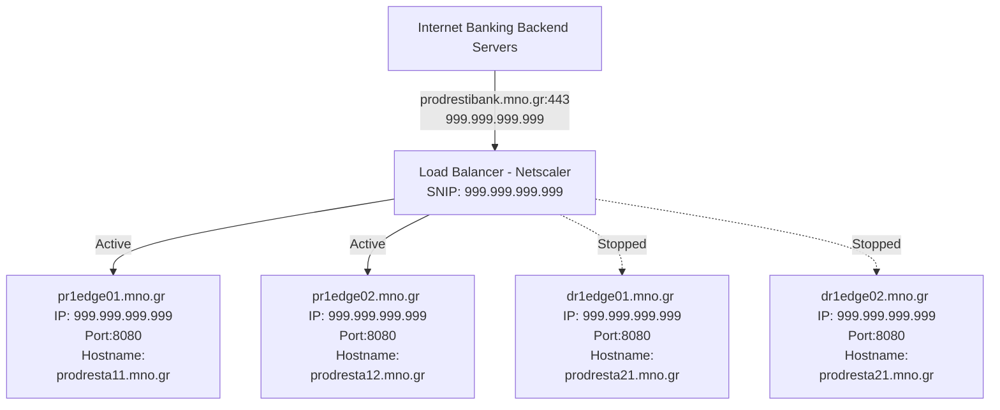
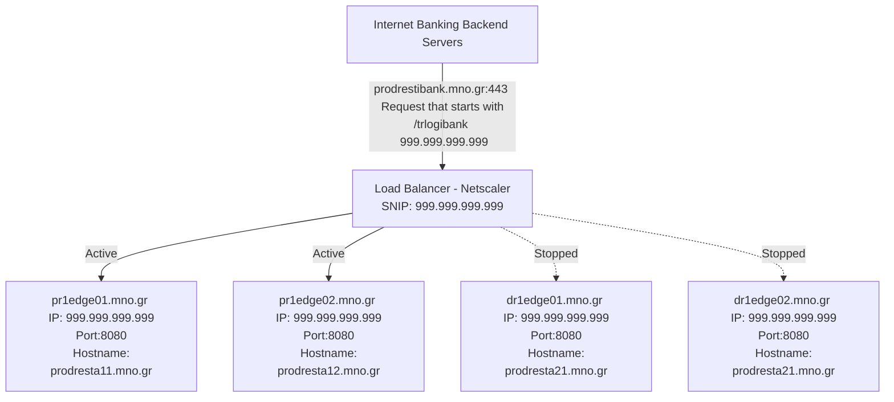
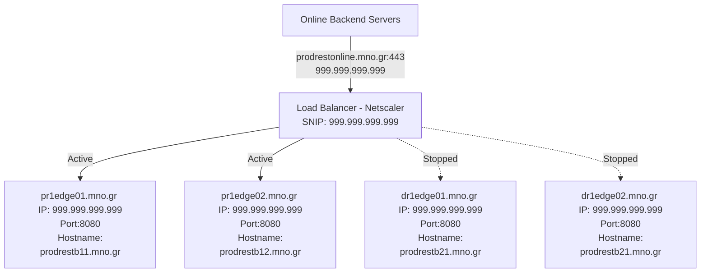
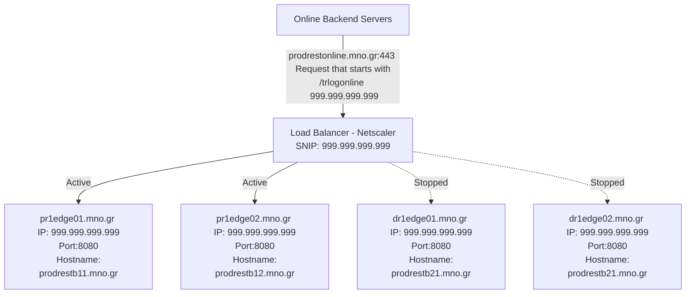
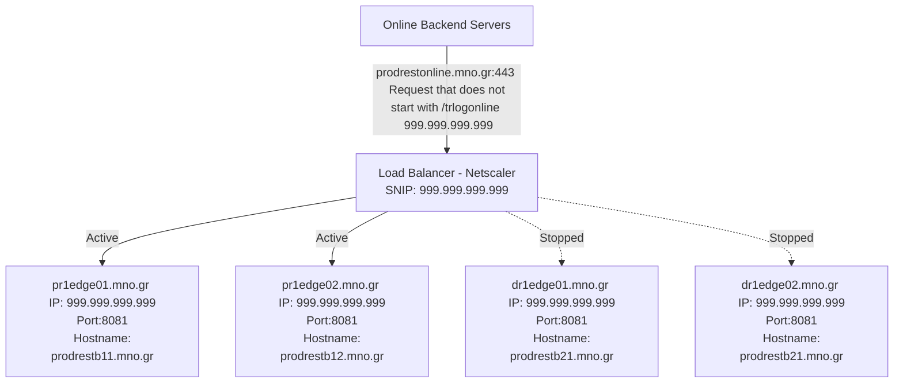

# Manage Wildfly

- [Manage Wildfly](#manage-wildfly)
  - [Scope](#scope)
    - [Glossary](#glossary)
  - [Setup](#setup)
    - [Internet Banking Wildfly Instances](#internet-banking-wildfly-instances)
      - [prodrestib](#prodrestib)
      - [prodrestibmetrics](#prodrestibmetrics)
    - [Internet Banking Loadbalancer farms](#internet-banking-loadbalancer-farms)
      - [Original setup for Internet Banking](#original-setup-for-internet-banking)
      - [Setup with routing for Internet Banking](#setup-with-routing-for-internet-banking)
    - [Online Wildfly Instances](#online-wildfly-instances)
      - [prodreston](#prodreston)
      - [prodrestintapps](#prodrestintapps)
    - [Online Loadbalancer farms](#online-loadbalancer-farms)
      - [Original setup for Online](#original-setup-for-online)
      - [Setup with routing for Online](#setup-with-routing-for-online)
    - [Consolidated Network Information](#consolidated-network-information)
      - [Production](#production)
      - [Development](#development)
      - [QA](#qa)
      - [Virtual IPs](#virtual-ips)
  - [Procedure](#procedure)
    - [Stop a Wildfly instance - prodrestib](#stop-a-wildfly-instance---prodrestib)
    - [Stop a Wildfly instance - prodreston](#stop-a-wildfly-instance---prodreston)
    - [Start a Wildfly instance - prodrestib](#start-a-wildfly-instance---prodrestib)
    - [Start a Wildfly instance - prodreston](#start-a-wildfly-instance---prodreston)

## Scope

Integration between the Big Data clusters and the backend servers of mno is done over REST APIs. The applications that handle the HTTP calls are installed on the edge servers of both sites. At normal operation only one site is active. These applications are deployed on top of Wildfly instances. There are four sets of Wildfly installations one for the `ibank` flow and one for the `online` flow and two others for applications developed by mno. All application servers are managed by `supervisord` owned by `root` user.

**DEV/QA Information**:

The information below are written for the Production enviroment. There is a development/QA environment that runs only on DR site. In case of a problem the paths are exectly the same if you substitute the `prod` with the `dev` preffix. For the networking part of the DEV/QA environment use the [Network Information](#network-information) chapter

### Glossary

- NetScaler: Loadbalancer managed by mno. It handles SSL offloading
- VIP: Virtual IP of the Loadbalancer
- SNIP: IP of the Loadbalancer that initiates the connection to Wildfly instances
- Health check: Endpoint that the Loadbalancer uses to determine if a specific Wildfly instance is active. It expects a `HTTP 200/OK` response

## Setup

### Internet Banking Wildfly Instances

#### prodrestib

Handles ingestion and queries for the Internet Banking (`ibank`) flow.

**User**: `PRODREST`

**Port**: `8080`

**Health Check Endpoint**: `/trlogibank/app`

**Supervisor Configuration**: `/etc/supervisor.d/wildfly-prodrestib.ini`

**Installation Path**: `/opt/wildfly/default/prodrestib`

**Deployments Path**: `/opt/wildfly/default/prodrestib/standalone/deployments`

**General Configuration Path**: `/opt/wildfly/default/prodrestib/standalone/configuration/standalone.xml`

**Application Configuration Path**: `/opt/wildfly/default/prodrestib/standalone/configuration/BigStreamer/beanconfig/translogApiIBankJmxConfig.xml`

**Application Logs**: `/var/log/wildfly/prodrestib/server.log`

**Access Log**: `/var/log/wildfly/prodrestib/access.log`

#### prodrestibmetrics

Hosts applications developed by mno and accessed by the Internet Banking backend servers. **This instance is not supported by jkl Telecom S.A.**

**User**: `PRODREST`

**Port**: `8081`

**Health Check Endpoint**: `/ibankmetrics/app`

**Supervisor Configuration**: `/etc/supervisor.d/wildfly-prodrestibmetrics.ini`

**Installation Path**: `/opt/wildfly/default/prodrestibmetrics`

**Deployments Path**: `/opt/wildfly/default/prodrestibmetrics/standalone/deployments`

**General Configuration Path**: `/opt/wildfly/default/prodrestibmetrics/standalone/configuration/standalone.xml`

**Application Configuration Path**: `Managed by mno`

**Application Logs**: `/var/log/wildfly/prodrestibmetrics/server.log`

**Access Log**: `/var/log/wildfly/prodrestibmetrics/access.log`

### Internet Banking Loadbalancer farms

There are two active Loadbalancers for Internet Banking. The original setup routes all traffic to `prodrestib`, while the later one routes conditionaly traffic between `prodrestib` and `prodrestibmetrics`

#### Original setup for Internet Banking



#### Setup with routing for Internet Banking

If the request from `ibank` starts with `/trlogibank`:



If the request from `ibank` does not start with `/trlogibank`:


### Online Wildfly Instances

#### prodreston

Handles ingestion and queries for the Online (`online`) flow.

**User**: `PRODREST`

**Port**: `8080`

**Health Check Endpoint**: `/trlogonline/app`

**Supervisor Configuration**: `/etc/supervisor.d/wildfly-prodreston.ini`

**Installation Path**: `/opt/wildfly/default/prodreston`

**Deployments Path**: `/opt/wildfly/default/prodreston/standalone/deployments`

**General Configuration Path**: `/opt/wildfly/default/prodreston/standalone/configuration/standalone.xml`

**Application Configuration Path**: `/opt/wildfly/default/prodreston/standalone/configuration/BigStreamer/beanconfig/translogApiOnlineJmxConfig.xml`

**Application Logs**: `/var/log/wildfly/prodreston/server.log`

**Access Log**: `/var/log/wildfly/prodreston/access.log`

#### prodrestintapps

Hosts applications developed by mno and accessed by the Online backend servers. **This instance is not supported by jkl Telecom S.A.**

**User**: `PRODREST`

**Port**: `8081`

**Health Check Endpoint**: `/intapps/app`

**Supervisor Configuration**: `/etc/supervisor.d/wildfly-prodrestintapps.ini`

**Installation Path**: `/opt/wildfly/default/prodrestintapps`

**Deployments Path**: `/opt/wildfly/default/prodrestintapps/standalone/deployments`

**General Configuration Path**: `/opt/wildfly/default/prodrestintapps/standalone/configuration/standalone.xml`

**Application Configuration Path**: `Managed by mno`

**Application Logs**: `/var/log/wildfly/prodrestintapps/server.log`

**Access Log**: `/var/log/wildfly/prodrestintapps/access.log`

### Online Loadbalancer farms

There are two active Loadbalancers for Online. The original setup routes all traffic to `prodreston`, while the later one routes conditionaly traffic between `prodreston` and `prodrestintapps`

#### Original setup for Online



#### Setup with routing for Online

If the request from `online` starts with `/trlogonline`:



If the request from `online` does not start with `/trlogonline`:



### Consolidated Network Information

#### Production

|   #   |     Hostname     | Prod-Rest-1 Hostname | Prod-Rest-1 IP | Prod-Rest-2 Hostname | Prod-Rest-2  IP |
| :---: | :--------------: | :------------------: | :------------: | :------------------: | :-------------: |
|  001  | pr1edge01.mno.gr |  prodresta11.mno.gr  |  999.999.999.999  |  prodrestb11.mno.gr  |  999.999.999.999   |
|  002  | pr1edge02.mno.gr |  prodresta12.mno.gr  |  999.999.999.999  |  prodrestb12.mno.gr  |  999.999.999.999   |
|  003  | dr1edge01.mno.gr |  prodresta21.mno.gr  |  999.999.999.999  |  prodrestb21.mno.gr  |  999.999.999.999   |
|  004  | dr1edge02.mno.gr |  prodresta22.mno.gr  |  999.999.999.999  |  prodrestb22.mno.gr  |  999.999.999.999   |

#### Development

|   #   |     Hostname     | Dev-Rest-1 Hostname | Dev-Rest-1 IP | Dev-Rest-2 Hostname | Dev-Rest-2 IP |
| :---: | :--------------: | :-----------------: | :-----------: | :-----------------: | :-----------: |
|  001  | pr1edge01.mno.gr |  devresta11.mno.gr  | 999.999.999.999  |  devrestb11.mno.gr  | 999.999.999.999  |
|  002  | pr1edge02.mno.gr |  devresta12.mno.gr  | 999.999.999.999  |  devrestb12.mno.gr  | 999.999.999.999  |
|  003  | dr1edge01.mno.gr |  devresta21.mno.gr  | 999.999.999.999  |  devrestb21.mno.gr  | 999.999.999.999  |
|  004  | dr1edge02.mno.gr |  devresta22.mno.gr  | 999.999.999.999  |  devrestb22.mno.gr  | 999.999.999.999  |

#### QA

|   #   |     Hostname     | QA-Rest-1 Hostname | QA-Rest-1 IP  | QA-Rest-2 Hostname | QA-Rest-2 IP  |
| :---: | :--------------: | :----------------: | :-----------: | :----------------: | :-----------: |
|  001  | pr1edge01.mno.gr |  qaresta11.mno.gr  | 999.999.999.999 |  qarestb11.mno.gr  | 999.999.999.999 |
|  002  | pr1edge02.mno.gr |  qaresta12.mno.gr  | 999.999.999.999 |  qarestb12.mno.gr  | 999.999.999.999 |
|  003  | dr1edge01.mno.gr |  qaresta21.mno.gr  | 999.999.999.999 |  qarestb21.mno.gr  | 999.999.999.999 |
|  004  | dr1edge02.mno.gr |  qaresta22.mno.gr  | 999.999.999.999 |  qarestb22.mno.gr  | 999.999.999.999 |

#### Virtual IPs

|   #   |       Hostname        |               IP               |                                      Servers                                       |                                              Comment                                              |
| :---: | :-------------------: | :----------------------------: | :--------------------------------------------------------------------------------: | :-----------------------------------------------------------------------------------------------: |
|  001  | prodrestibank.mno.gr  | 999.999.999.999 <br> 999.999.999.999 |   mno's Loadbalancer (Netscaler) <br> Source IP for the cluster:  999.999.999.999    |                        Used for the Production servers of Internet Banking                        |
|  002  | prodrestonline.mno.gr | 999.999.999.999  <br> 999.999.999.999 |   mno's Loadbalancer (Netscaler)  <br> Source IP for the cluster:  999.999.999.999    |                             Used for the Production servers of Online                             |
|  003  |  devrestibank.mno.gr  |          999.999.999.999           |   mno's Loadbalancer (Netscaler)  <br> Source IP for the cluster:  999.999.999.999    |   Used for the QA servers of Internet Banking  <br> Accessible to all developers' workstations    |
|  004  | devrestonline.mno.gr  |          999.999.999.999           |   mno's Loadbalancer (Netscaler)  <br> Source IP for the cluster:  999.999.999.999    |        Used for the QA servers of Online  <br> Accessible to all developers' workstations         |
|  005  |  qarestibank.mno.gr   |          999.999.999.999           |   mno's Loadbalancer (Netscaler)  <br> Source IP for the cluster:  999.999.999.999    |                                            **UNUSED**                                             |
|  006  |  qarestonline.mno.gr  |          999.999.999.999           |   mno's Loadbalancer (Netscaler)  <br> Source IP for the cluster:  999.999.999.999    |                                            **UNUSED**                                             |

## Procedure

### Stop a Wildfly instance - prodrestib

1. Shutdown the Health Check endpoint:

    - If you are in a call with mno, ask for a Network administrator to join the call
    - Ask them to disable **gracefully** the server (mention the two Loadbalancer IPs and the IP you want them to disable)
    - If there is no one from mno's networking team and **only after communicating with mno**, use the following command:
  
      From the server as `PRODREST`:

      ``` bash
      curl -XPUT https://<hostname>:8080/trlogibank/app/app-disable
      ```

    - Check access logs to ensure no traffic is sent to the Wildfly

2. Stop the Wildfly instance

    From the server as `root`:

    ``` bash
    supervisorctl stop wildfly-prodrestib
    ```

3. Ensure that Wildfly is down

    From the server as `root`:

    ``` bash
    ps -ef | grep 'prodrestib/'
    supervisorctl status wildfly-prodrestib
    tail -f /var/log/wildfly/prodrestib/server.log
    tail -f /var/log/wildfly/prodrestib/access.log
    ```

### Stop a Wildfly instance - prodreston

1. Shutdown the Health Check endpoint:

    - If you are in a call with mno, ask for a Network administrator to join the call
    - Ask them to disable **gracefully** the server (mention the two Loadbalancer IPs and the IP you want them to disable)
    - If there is no one from mno's networking team and **only after communicating with mno**, use the following command:
  
      From the server as `PRODREST`:

      ``` bash
      curl -XPUT https://<hostname>:8080/trlogonline/app/app-disable
      ```

    - Check access logs to ensure no traffic is sent to the Wildfly

2. Stop the Wildfly instance

    From the server as `root`:

    ``` bash
    supervisorctl stop wildfly-prodreston
    ```

3. Ensure that Wildfly is down

    From the server as `root`:

    ``` bash
    ps -ef | grep 'prodrestib/'
    supervisorctl status wildfly-prodreston
    tail -f /var/log/wildfly/prodreston/server.log
    tail -f /var/log/wildfly/prodreston/access.log
    ```

### Start a Wildfly instance - prodrestib

1. Check configuration:

    - If the server is in the DR site, check `/opt/wildfly/default/prodrestib/standalone/configuration/BigStreamer/beanconfig/translogApiIBankJmxConfig.xml` against PR site servers. The two sites are identical so the only change should be in hostnames.

2. Start the Wildfly instance

    From the server as `root`:

    ``` bash
    supervisorctl start wildfly-prodrestib
    ```

3. Ensure that Wildfly is up and has traffic

    From the server as `root`:

    ``` bash
    ps -ef | grep 'prodrestib/'
    supervisorctl status wildfly-prodrestib
    tail -f /var/log/wildfly/prodrestib/server.log
    tail -f /var/log/wildfly/prodrestib/access.log
    ```

### Start a Wildfly instance - prodreston

1. Check configuration:

    - If the server is in the DR site, check `/opt/wildfly/default/prodreston/standalone/configuration/BigStreamer/beanconfig/translogApiOnlineJmxConfig.xml` against PR site servers. The two sites are identical so the only change should be in hostnames.

2. Start the Wildfly instance

    From the server as `root`:

    ``` bash
    supervisorctl start wildfly-prodreston
    ```

3. Ensure that Wildfly is up and has traffic

    From the server as `root`:

    ``` bash
    ps -ef | grep 'prodreston/'
    supervisorctl status wildfly-prodreston
    tail -f /var/log/wildfly/prodreston/server.log
    tail -f /var/log/wildfly/prodreston/access.log
    ```
