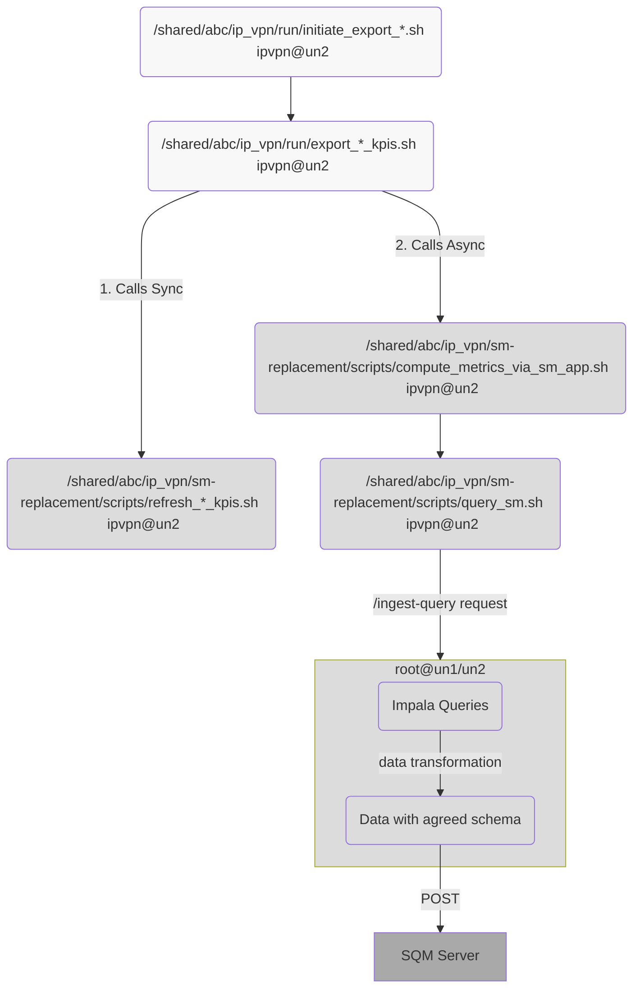
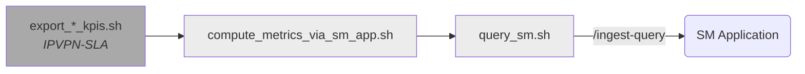

# Introduction
Overview of the replacement flow that calculates and exports KPIs (CPU, Memory, QoS, etc.) from BigStreamer to SQM via IPVPN-SM app.
This support document outlines the steps that compose the IPVPN-SM replacement process that computes Key Performance Indicators (KPIs) regarding the network quality of abc. The ETL process involves a series of scripts and a Spring Boot application that work together to retrieve, transform, and load data from Impala tables into a remdef server.
There are three major KPI categories, *Components*, *SLA* and *Interfaces*, which consist of the following subcategories:
|KPI category|Metrics involved| Relevant Impala tables|
|---|---|---|
|Components|CPU, Memory (MEM)|bigcust.nnm_ipvpn_componentmetrics_hist,<br>  nnmnps.nms_node |
|Interfaces|Interfaces (IF)|bigcust.perf_interfacemetrics_ipvpn_hist,<br>  bigcust.pe_interfaces,<br>  nnmnps.nms_node|
|SLA|Availability (AV), Quality of Service (QOS)|bigcust.nnmcp_ipvpn_slametrics_hist,<br> bigcust.customer_pl,<br> bigcust.customer_sla_config_ipvpn,<br> bigcust.sla_configurations|
# Application Flow
Step-by-step description of how the ETL pipeline is executed using scripts and Spring Boot app.
## Scripts & IPVPN-SM App operations
The metrics computation of each of the three categories (sla, components, interfaces) is triggered by the `un2:/shared/abc/ip_vpn/run/initiate_export_*.sh` script that runs as part of the IPVPN-SLA [cronjob](https://metis.ghi.com/obss/bigdata/abc/ipvpn/ip-vpn-sla/ipvpnsla-customers-devops/-/blob/master/PROD/crontab/crontab_per_user.txt), scheduled to run every 5 minutes, and the computation refers to a full five-minute interval.
The ETL process follows the following flow:
### IPVPN-SLA
- [IPVPN-SLA Support Doc](/KnowledgeBase/abc/BigStreamer/supportDocuments/applicationFlows/ip_vpn.md)
### IPVPN-SM
- [IPVPN-SM Dev Wiki](https://metis.ghi.com/obss/bigdata/abc/ipvpn/ip-vpn-sla/ipvpn-sm-devops/-/wikis/home)
3. The `export_*_kpis.sh` calls the IPVPN-SM App to execute the Impala queries. The curl request to the IPVPN-SM App is executed asynchronously, allowing the IPVPN-SM pipeline to continue with other scheduled 5 min intervals without waiting for the query results.
4. The IPVPN-SM App executes the Impala queries, applies transformations on the result set based on the agreed schema specifications, and sends the results to the SQM server.
## IPVPN-SM Application
The IPVPN-SM Application executes the Impala queries specified in the `/shared/abc/ip_vpn/sm-app/deployment/config/field-mappings.yml`, applies transformations on the result set based on the agreed [schema specifications](https://metis.ghi.com/obss/bigdata/abc/ipvpn/ip-vpn-sla/ipvpn-sm-devops/-/wikis/Data-Transmission-Schema) , and sends the results to the SQM server.
### IPVPN-SM Endpoint: /ingest-query
The endpoint for the IPVPN-SM application is `/ingest-query`. This endpoint should be called with a POST request.
Details on the request body fields and examples [here](https://metis.ghi.com/obss/bigdata/abc/ipvpn/ip-vpn-sla/ipvpn-sm-devops/-/wikis/Application-details#request-body-1)
### Check application status
```bash
curl --location --request GET 'un-vip:13001/ipvpn-sm/app/status'
```
## Application Flow Diagram

# Infrastructure
Step-by-step description of how the ETL pipeline is executed using scripts and Spring Boot app.
The ETL pipeline infrastructure includes the following components:
## Application
- un1/un2 files
	- **Deployment path**: `/shared/abc/ip_vpn/sm-app/deployment`
	- **Configuration**: `/shared/abc/ip_vpn/sm-app/deployment/config`
		- [application.yml](https://metis.ghi.com/obss/bigdata/abc/ipvpn/ip-vpn-sla/ipvpn-sm-devops/-/blob/main/PROD/deployment/config/application.yml)
	- **Logs**: `/shared/abc/ip_vpn/sm-app/deployment/logs`
- Data sources:
	- **Impala**:  `un-vip.bigdata.abc.gr:21050`
	- **hive database**: `bigcust`
- Authentication:
  The authentication to Impala is done with Kerberos. The files used are:
    - `/etc/krb5.conf`
    - `/shared/abc/ip_vpn/sm-app/deployment/config/jaas.conf`
    - `/home/users/ipvpn/ipvpn.keytab`
- IPVPN-SM app:
  The application uses HAProxy, a load balancer that distributes incoming requests to the deployed application nodes.
  - **HAProxy**:
  Host: `un-vip` ,
  Port: `13001`
  - **Application**:
    Hosts: `un1/un2`,
    Active Ports:
      - HTTP port : `13000`
      - JMX port : `13800`
- External SQM server:
	- **host**: `gw-prod-sqm.aksprd.abc.gr`
	- **port**: `443`
	- **endpoint**: `/inventory/measurements`
## Bash scripts
| Script | Description | Location |
|--------|-------------|----------|
| `initiate_export_*.sh` | Triggers category-specific KPI exports | `/shared/abc/ip_vpn/run/` |
| `compute_metrics_via_sm_app.sh` | Prepares & posts payload to SM App | `/shared/abc/ip_vpn/sm-replacement/scripts/` |
| `query_sm.sh` | Constructs the payload for SM App | Same as above |
| `sm-replacement-call-repeater.sh` | Manual runner across intervals | Same as above |
List of helper scripts used by the SLA cronjob and their role in preparing and triggering requests.
In addition to the IPVPN-SM application, IPVPN-SM utilizes certain bash scripts. Their primary purpose is to generate the appropriate input data that is subsequently passed as the body parameter in the POST requests to the IPVPN-SM application.
They are invoked by the IPVPN-SLA `export_*_kpis.sh` [scripts](https://metis.ghi.com/obss/bigdata/abc/ipvpn/ip-vpn-sla/ipvpnsla-customers-devops/-/blob/master/PROD/nnmnps/bin/export_component_kpis.sh).
- **Node**: `un2`
- **User**: `ipvpn`
- **Scripts**: `/shared/abc/ip_vpn/sm-replacement/scripts`
- **IPVPN-SM App host & port configured in file** : `/shared/abc/ip_vpn/sm-replacement/scripts/config.properties`
- **Logs**: `/shared/abc/ip_vpn/sm-replacement/log`
The specific order in which they are called is the following:

## Deployment Instructions
Stop/Start guide on [abc_BigStreamer_Apps_MoP_Restart.docx](https://ghi.sharepoint.com/:w:/t/abcBigData/EZsK97GxFyVHkeBoFTFjuRYBtPF7lK86cTA44wMhayNlNA?e=Gjh0ZO)  
Check project wiki [here](https://metis.ghi.com/obss/bigdata/abc/ipvpn/ip-vpn-sla/ipvpn-sm-devops/-/wikis/Application-details#deployment-instructions)
## SQM Token Authentication
The authentication on the SQM server is done with the HTTP Token Auth in IPVPN-SM application. It requires providing the keystore file, where the token is stored.
# Failure Handling
How to debug failed requests, interpret logs, and what to check first when something breaks.
## Logs
### Failure Log Locations
#### Script Logs on un2
The scripts which refresh the Impala tables and which call the IPVPN-SM application write logs under the directories:
1. The `refresh_*_.sh script` Logs
`/shared/abc/ip_vpn/sm-replacement/log/refresh_*_kpis`
2. The `compute_metrics_via_sm_app.sh` Logs
`/shared/abc/ip_vpn/sm-replacement/log/compute_via_sm_app_*`
The asterisk is used to dendef the type of the particular category.
#### Application Logs on un1/un2
In case of failure, the logs related to the IPVPN-SM app are the following:
1. **Access Logs**
`/shared/abc/ip_vpn/sm-app/deployment/logs/tomcat/access_log.log`
2. **Application Logs**
`/shared/abc/ip_vpn/sm-app/deployment/logs/application.log`
3. **Requests sent to SQM Server**
`/shared/abc/ip_vpn/sm-app/deployment/logs/sm-server-requests.log`
#### IPVPN-SLA Logs on `un2`
Aside from the above logs, the operation of the IPVPN-SLA scripts is also monitored by the original implementation. Details about the logging of IPVPN-SLA can be found [here](/KnowledgeBase/abc/BigStreamer/supportDocuments/applicationFlows/ip_vpn.md)
### Auto-retry mechanism
During the schedules runs, if the call to the IPVPN-SM app fails, the call to the application is repeated. If the application fails on all 5 attemps, the script exits. On each failed attempt, an email alert is sent via the monitoring app. This operation is done inside the `un2:/shared/abc/ip_vpn/sm-replacement/scripts/compute_metrics_via_sm_app.sh` script.
# Support
Where to check system health (Grafana, MySQL), common exceptions and their causes, and support scripts.
## Check request status via Monitoring
### Visual Dashboards (Grafana)
Check grafana dashboard for failed requests:
`https://unc1.bigdata.abc.gr:3000/d/HiuaKlU4z/ipvpn-sm-replacement-monitoring?orgId=1&refresh=5s`
### Monitoring DataBase (MySQL)
IPVPN-SM App uses Monitoring App in order to record statistics regarding the status of each metric computation request. Querying monitoring DB allows us to investigate pdefntial failed requests.
1. Connect to monitoring DB
`mysql -umonitoring -p -h 999.999.999.999`
2. `use monitoring;`
#### See failed requests in the past 24h excluding EmptyQuery Exceptions
Often persistent EmptyQuery alerts demand further investigation in the CustomPoller component of IPVPN-SLA application and the associated metrics cannot be retrieved from the Impala tables.   
To identify failed metrics in the past 24h due to errors other than EmptyQuery exceptions, we can use the following query
```sql
mysql> select distinct x.job, x.5min_interval_ts, x.sent_to_SQM, y.request_repetitions, x.exception from ( select d.job, DATE_FORMAT( STR_TO_DATE( operative_partition, '%Y%m%d%H%i%s' ), '%Y-%m-%d %H:%i' ) as 5min_interval_ts, c.operative_partition, c.status AS 'sent_to_S
QM', DATE_FORMAT( metric_ts_start, '%Y-%m-%d %H:%i:%s' ) as metric_ts_start, DATE_FORMAT( c.system_ts, '%Y-%m-%d %H:%i:%s' ) as metric_ts_end, SUBSTRING_INDEX( c.message, 'com.jkl.bigstreamer.abc.ipvpn.sm.exception.', -1 ) as exception from ( SELECT job, compone
nt as start_comp, status as started, operative_partition as start_oppart, system_ts as metric_ts_start FROM jobstatus WHERE application = "IPVPN-SM" and system_ts >= now() - INTERVAL 1 DAY and component = 'MAIN_START' and message = 'n_attempt=0' order by system_ts desc,
job ) d inner join ( select b.* from ( SELECT MAX(system_ts) as max_ts FROM jobstatus WHERE application = "IPVPN-SM" and system_ts >= now() - INTERVAL 1 DAY and component = 'MAIN_END' group by operative_partition, job ) a inner join ( SELECT * FROM jobstatus WHERE applic
ation = "IPVPN-SM" and system_ts >= now() - INTERVAL 1 DAY and component = 'MAIN_END' ) b on a.max_ts = b.system_ts ) c on d.job = c.job and d.start_oppart = c.operative_partition order by 5min_interval_ts desc ) x left join ( select count(*)-1 as 'request_repetitions',
job, operative_partition from jobstatus where application = "IPVPN-SM" and system_ts >= now() - INTERVAL 1 DAY and component = 'MAIN_START' group by operative_partition, job ) y on x.operative_partition = y.operative_partition and x.job = y.job where sent_to_SQM="FAILED"
 and SUBSTRING_INDEX( exception, ':', 1 )!="AppEmptyQueryException" order by 5min_interval_ts desc;

+-----+------------------+-------------+---------------------+-------------------+
| job | 5min_interval_ts | sent_to_SQM | request_repetitions | exception         |
+-----+------------------+-------------+---------------------+-------------------+
| AV  | 2023-05-17 13:30 | FAILED      |                   2 | SMSystemException |
| CPU | 2023-05-17 13:30 | FAILED      |                   2 | SMSystemException |
| MEM | 2023-05-17 13:30 | FAILED      |                   2 | SMSystemException |
| IF  | 2023-05-17 13:30 | FAILED      |                   2 | SMSystemException |
| QOS | 2023-05-17 13:30 | FAILED      |                   2 | SMSystemException |
| AV  | 2023-05-17 13:25 | FAILED      |                   2 | SMSystemException |
| CPU | 2023-05-17 13:25 | FAILED      |                   2 | SMSystemException |
| IF  | 2023-05-17 13:25 | FAILED      |                   2 | SMSystemException |
| MEM | 2023-05-17 13:25 | FAILED      |                   2 | SMSystemException |
| QOS | 2023-05-17 13:25 | FAILED      |                   2 | SMSystemException |
+-----+------------------+-------------+---------------------+-------------------+

```
These are the requests that should be manually handled following the actions described next.
#### Inspect specific metric request
In case of alerts, we should first check the status of the particular requests on the monitoring DB.
Using the metric category and the reference interval associated with a request to IPVPN-SM App we can query the Monitoring DB
by passing the corresponding job and operative_partition values.
- `select application, job,component, operative_partition, status, message, system_ts from jobstatus where application="IPVPN-SM" and job="<category>" and operative_partition="<YYYYMMDDhhmmss>" order by system_ts;`
For example. if we want to check the status of a request for QOS metric category and `2023-05-10 06:55:00` reference interval:
```sql
mysql> select application, job,component, operative_partition, status, message, system_ts from jobstatus where application="IPVPN-SM" and job="QOS" and operative_partition="20230510065500" order by system_ts;
+-------------+-----+------------+---------------------+---------+----------------------------------------------------------------------------+-------------------------+
| application | job | component  | operative_partition | status  | message                                                                    | system_ts               |
+-------------+-----+------------+---------------------+---------+----------------------------------------------------------------------------+-------------------------+
| IPVPN-SM    | QOS | MAIN_START | 20230510065500      | SUCCESS | n_attempt=0                                                                | 2023-05-10 07:04:51.000 |
| IPVPN-SM    | QOS | MAIN_END   | 20230510065500      | FAILED  | com.jkl.bigstreamer.abc.ipvpn.sm.exception.AppEmptyQueryException | 2023-05-10 07:05:02.000 |
| IPVPN-SM    | QOS | MAIN_START | 20230510065500      | SUCCESS | n_attempt=1                                                                | 2023-05-10 07:05:22.000 |
| IPVPN-SM    | QOS | MAIN_END   | 20230510065500      | SUCCESS |                                                                            | 2023-05-10 07:05:35.000 |
+-------------+-----+------------+---------------------+---------+----------------------------------------------------------------------------+-------------------------+
4 rows in set (0.01 sec)
```
According to the above results, we conclude that the computation of the QOS metrics for the selected 5min interval failed on the first attempt with AppEmptyQueryException error. However the request was successful on the second attempt.
#### Inspect overall requests' status
If we want to check if any of the requests has failed, for instance in the past 24h
```
select application, job,component, operative_partition, status, message, system_ts from jobstatus where application="IPVPN-SM" and component="MAIN_END" and status="FAILED" and system_ts >= now() - INTERVAL 1 DAY;
```
##  Pdefntial Error Cases
### AppEmptyQueryException (Impala Query Returned No Data)
This exception occurs when the executed Impala query fails. The underlying reason behind this message can be one the following:
1. The query did not retrieve any records for the `specified 5min interval`. For category **IF**, this type of failure of a 5min interval may cause the failure of `the following 5min interval` as well. This occurs because an aggregation between two consecutive intervals is performed. 
2. Inability to open one of the HDFS files that constitute a table associated with the particular Impala query.
3. Unreachable Impala deamon.
4. Inability to allocate Memory (OutOfMemoryError: unable to create new native thread).
**Support Action:** [Add metrics manually](#call-the-ipvpn-sm-app-manually-on-un2)
If the `bigcust` tables are empty, manually adding metrics won't be effective. In such cases, it's crucial to conduct a detailed investigation to pinpoint the specific step within the IPVPN-SLA process where the failure occurred. Such an investigation is documented [here](../procedures/ipvpn_sm_AppEmptyQuery_resolution_MoP.md)
### SMSystemException (SQM Ingestion Failure)
The above exception is solely due to SQM server's inability to ingest the information sent by IPVPN-SM App.
**Support Action:** [Add metrics manually](#call-the-ipvpn-sm-app-manually-on-un2)
### SMValidationException (Schema Mismatch)
This occurs in the case when the schema of the data sent does not comply with the agreed schema.
**Support Action:** [Add metrics manually](#call-the-ipvpn-sm-app-manually-on-un2)
### AppQueryIngestionException (Transformation Failure)
This can occur due to inability to apply the particular transformation on the retrieved data.
**Support Action:** [Add metrics manually](#call-the-ipvpn-sm-app-manually-on-un2)
### SMAuthException (Token Auth Failure)
This occurs if the token used as basic HTTP authentication to the SQM endpoint is rejected.
**Support Actions:**
1. [Update keystore with the new credentials](#update-http-auth-token)
2. [Add metrics manually](#call-the-ipvpn-sm-app-manually-on-un2)
## Actions
### Update HTTP Auth Token
1. Create keystore
```
keytool -importpass -alias sm_token -storetype JCEKS -validity 365000 -keystore credentials.keystore
```
2. Enter <keystore_pw>
2. Save the given credentials in the format: `username:password`
#### Instructions to update the file if given new credentials
1. Update keystore
`keytool -keypasswd -keystore credentials.keystore -alias sm_token`
2. Enter <keystore_pw>
3. Enter new credentials in the format: `username:password`
### Manual Retry: sm-replacement-call-repeater.sh {#manual-call}
In case we want to bypass the scripts running on un2 we can post a request directly on the IPVPN-SM application, either by performing a curl request specifying the [request body](#request-body) details or by running the script `/shared/abc/ip_vpn/sm-replacement/scripts/sm-replacement-call-repeater.sh` providing the arguments:
- `category`, one the valid category types {AV,QOS,CPU,MEM,IF}
- `reference-start-time` in the format yyyyMMddHHmm
- `reference-end-time` in the format yyyyMMddHHmm (inclusive)
The script will successively call the `refresh_*_.sh` and  `compute_metrics_via_sm_app.sh` scripts for the given category and the period specified by the end and start arguments.
1. In case we want perform the execution for just **one 5m interval**, we provide the same argument for `reference-start-time` and `reference-end-time` fields. E.g. for 5m period of 18/12/2022 10:10:
```
./sm-replacement-call-repeater.sh CPU 202212181010 202212181010
```
2. If we want to perform requests for **5 multiple consecutive** 5min intervals E.g. for 5m periods of 18/12/2022 10:10 to 10:30 (inclusive):
```
./sm-replacement-call-repeater.sh CPU 202212181010 202212181030
```
The logs of this operation are appended to the log files in `/shared/abc/ip_vpn/sm-replacement/log/compute_via_sm_app_*`.