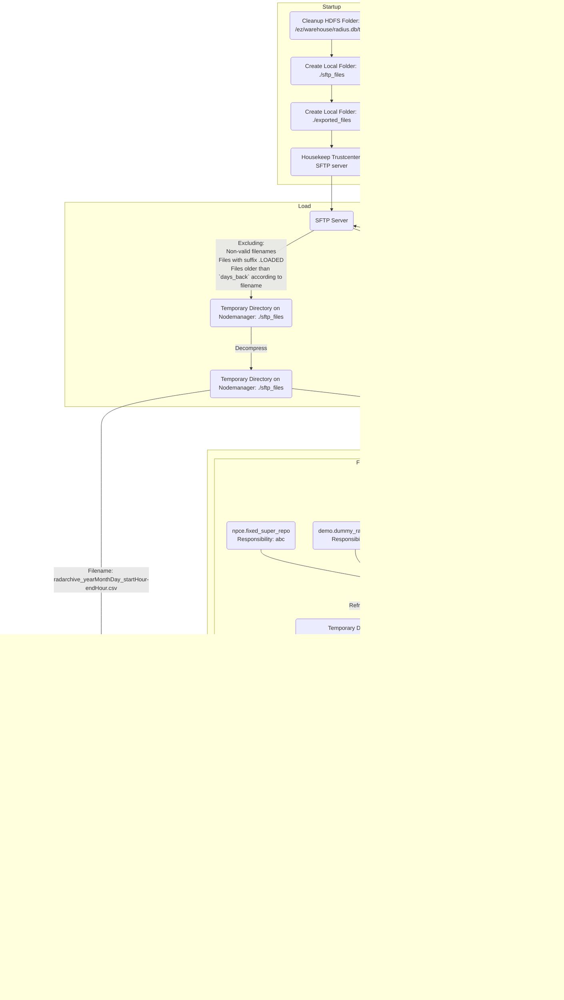

# Radius
The Radius ETL process ingests user accounting data and session logs from the Trustcenter SFTP server. It transforms and loads the files into Hive and Kudu tables through hourly workflows and maintains data freshness using regular housekeeping and statistics recomputation.
## Main Flow
This section describes the main ETL pipeline of the Radius flow, which loads and processes radarchive and radacct CSVs from an external SFTP server into Hive and Kudu tables.

- **User**: `radius`  
- **Coordinator**: `Radius_Load_Coordinator`  
- **Workflow**: `Radius_Load_Workflow`
- **HDFS path**: `/user/radius`
- **Runs**: `every 1h and 30mins`
- **Config file**: `HDFS: /user/radius/config/settings_prod.ini`
- **Logs**: From Hue go to `Job Browser -> Workflows` and filter with the workflow name
- **Input SFTP Server**:
  - **Host**: `999.999.999.999`
  - **Port**: `22`
  - **User**: `prdts`
  - **Remdef Files Folder**: `/home/prdts/transfer`
  - **Port Forward**:
    - **Host**: `un-vip.bigdata.abc.gr`
    - **Port**: `2222`
- **Trustcenter SFTP Server**:
  - **Host**: `unc2.bigdata.abc.gr`
  - **Port**: `22`
  - **User**: `trustcenterftp`
  - **Remdef Files Folder**: `/rd`
**Alerts**:
- Mail
  - Subject: Radius Flow failed
  - Alerts that indicate problem with Input SFTP server:
    - Body starts with: `No upcoming files for more than 3h`
    - Body starts with: `Files found with a late timestamp.`
    - Body starts with: `Could not rename file`
  - Alerts that indicate problem with Trustcenter SFTP Server:
    - Body starts with: `Could not perform radacct_enriched housekeeping on sftp server`
  - Alerts that indicate general failures without specific cause:
    - Body starts with: `Insert data failed` and then lists the status for each file
**Troubleshooting Steps**:
- If an alert has been received, use the message from the e-mail to determine the root cause for the failure.
  - For failures with Input SFTP server:
    - Inform abc in order to check the Input SFTP Server
    - If abc does not detect any problems, check connectivity:
      From `un2.bigdata.abc.gr` with personal user:
      ``` bash
      su - radius
      sftp prdts@999.999.999.999
      # Check for files
      sftp> ls -l
      ```
  - For failures with Trustcenter SFTP Server:
    - Check `unc2.bigdata.abc.gr` for any errors
- If no alerts have been received or the problem is not specified determine the root cause for the failure with the following steps:
  - Check for failed executions
    From `un2.bigdata.abc.gr` with personal user:
    ```bash
    curl --location --request GET 'http://un-vip.bigdata.abc.gr:12800/monitoring/api/jobstatus/find?application=RADIUS&status=FAILED&operativePartition=<date in YYYYMMDD e.g.:20220518>'
    ```
    For additional query parameters check [here](https://metis.ghi.com/obss/bigdata/common-dev/apps/monitoring/monitoring-devops/-/wikis/API-Functional-Spec#fields)
    or check via the corresponding [Grafana dashboard](https://unc1.bigdata.abc.gr:3000/d/J4KPyBoVk/radius-dashboard?orgId=1&from=now-2d&to=now)
  - Check the logs for the failed execution.
- After the underlying problem has been corrected the next execution of the flow will load any files that have been delayed or failed to be loaded in a previous execution.
- If the customer requests to load specific files after they have been processed by the flow. **In order to avoid duplicate data we have to reload the whole partition.**
  - Ensure the files are still available on the SFTP server
    From `un2.bigdata.abc.gr` with personal user:
    ``` bash
    su - radius
    sftp prdts@999.999.999.999
    # Check for files covering the whole date affected
    sftp> ls -l *.LOADED
    ```
  - Suspend coordinator `Radius_Load_Coordinator`
  - Drop partitions that were not properly loaded from following tables
    From `un2.bigdata.abc.gr` with personal user:
    ``` bash
    su - radius
    kinit -kt /home/users/radius/radius.keytab radius
    impala-shell -i un-vip.bigdata.abc.gr -k --ssl
    ```
    - In case of radarchive category of file:
      ```sql
      alter table radius.radarchive drop partitions (par_dt="<date in YYYYMMDD e.g.: 20220915>")
      ```
    - In case of radacct category of file:
      ```sql
      alter table radius.radacct drop partitions (par_dt="<date in YYYYMMDD e.g.: 20220915>")
      ```
  - Connect to SFTP server and rename files with filename timestamp equal to above-mentioned partition(s) and the same category:
    From `un2.bigdata.abc.gr` with personal user:
    ``` bash
    su - radius
    sftp prdts@999.999.999.999
    # For every file you need to reload
    sftp> rename <filename>.LOADED <filename>
    ```
  - Resume coordinator `Radius_Load_Coordinator`
## Kudu Housekeeping and Compute Statistics Flow
This secondary flow enforces retention on the Kudu table radius.radreference and recomputes Impala statistics for radarchive and radacct daily.

- **User**: `radius`  
- **Coordinator**: `Radius_Kudu_Retention_Coordinator` 
- **Workflow**: `Radius_Kudu_Retention_Workflow`
- **HDFS path**: `/user/radius`
- **Runs**: `once a day at 2:25 (UTC)`
- **Config file**: `hdfs: /user/radius/Kudu_Retention_And_Compute_Stats/settings.ini`
- **Logs**: From Hue go to `Job Browser -> Workflows` and filter with the workflow name
**Alerts**:
- Not monitored
**Troubleshooting Steps**:
- Check the logs for the failed execution.
- After the underlying problem has been corrected the next execution of the flow will apply the correct retention to the Kudu table and compute the missing statistics.