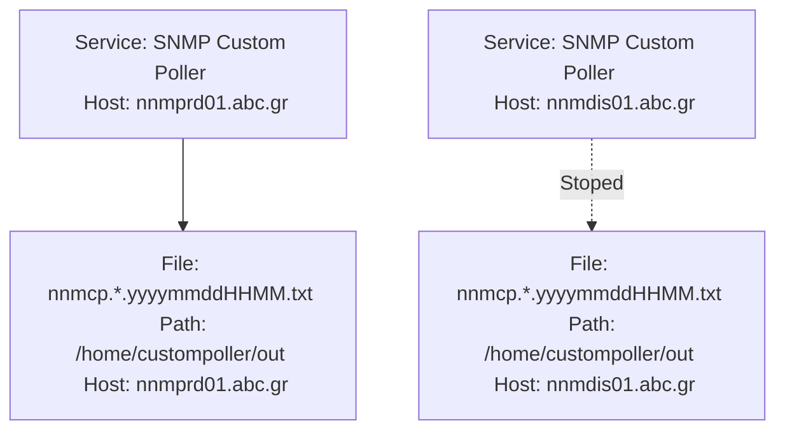
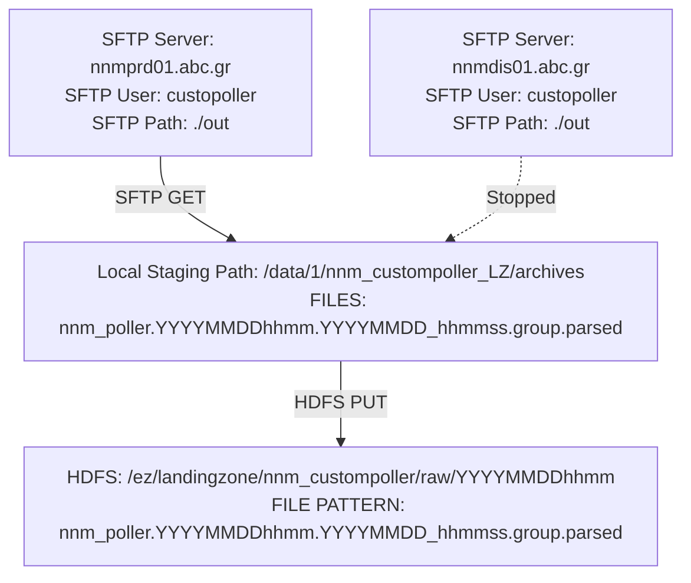
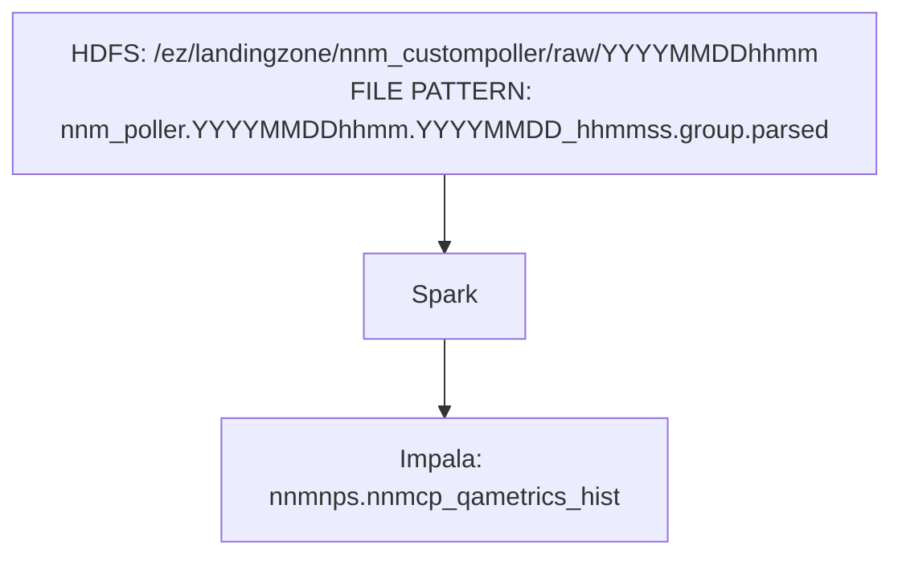
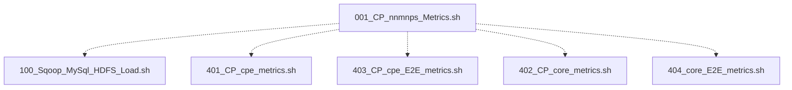
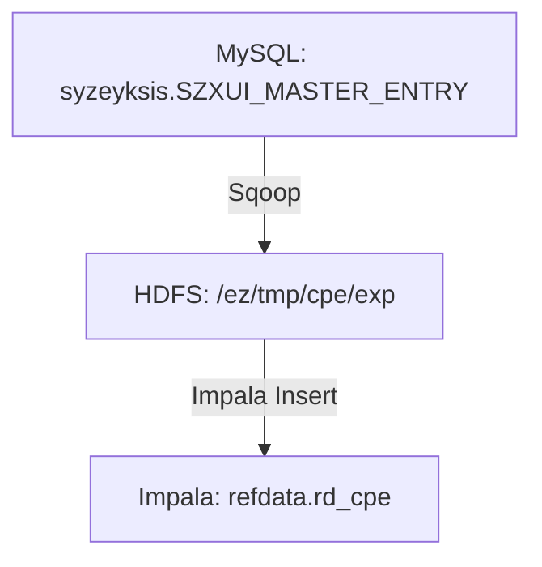
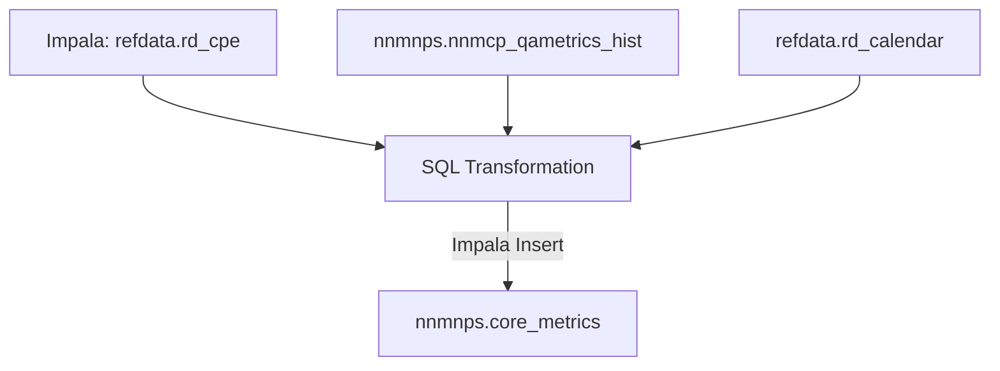
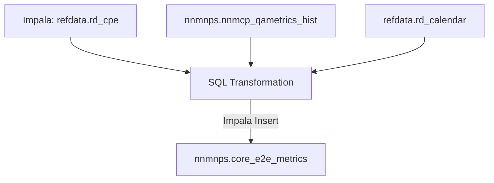
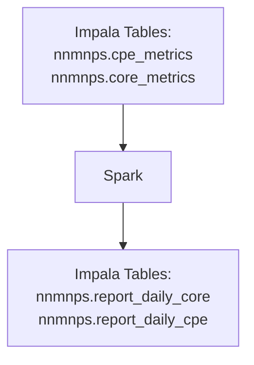
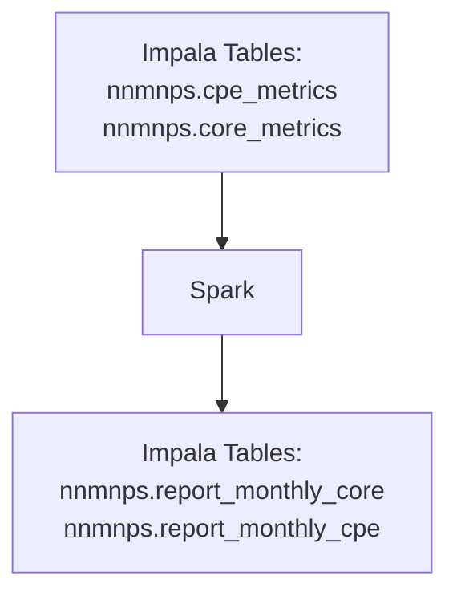
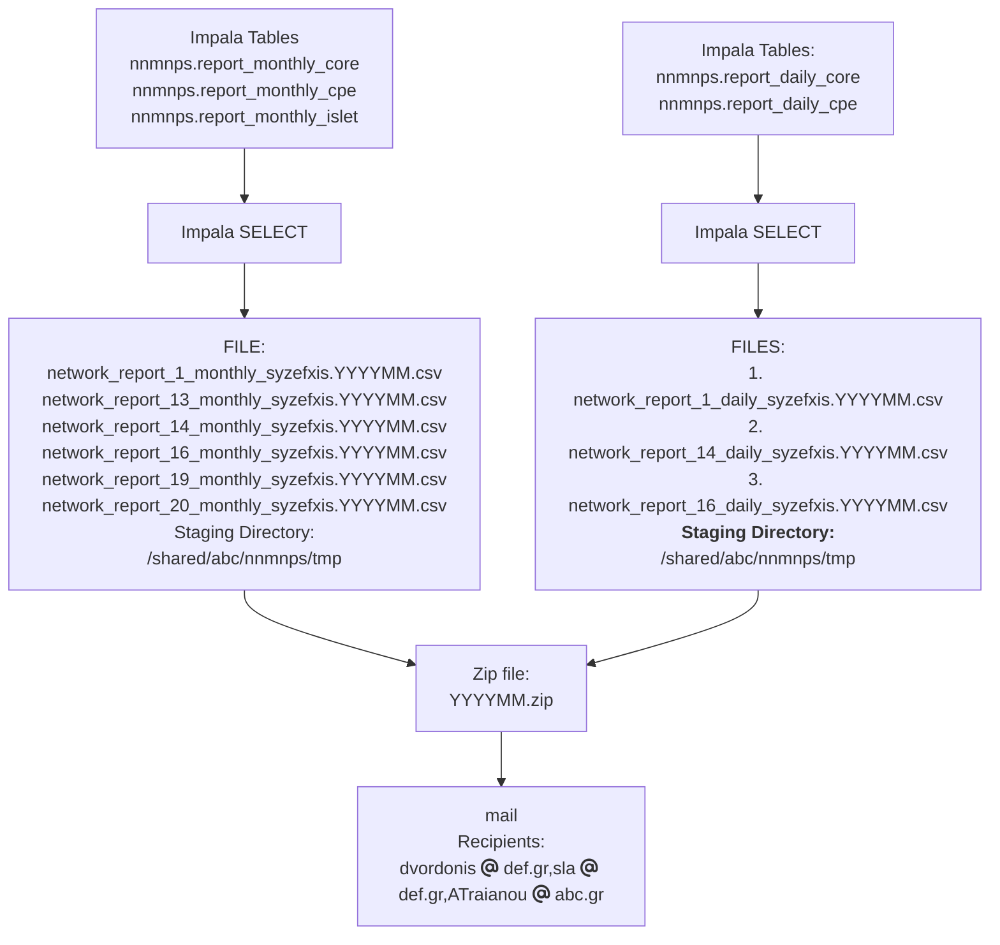

# Syzefxis Flows
## Useful Links
- [Business Documents](https://metis.ghi.com/obss/bigdata/abc/sizefxis/bigstreamer-sizefxis-devops/-/tree/master/docs)
- [MoP documents](https://metis.ghi.com/obss/bigdata/abc/sizefxis/bigstreamer-sizefxis-devops/-/tree/master/MOPs)
- Users **keePass file**: [abc-devpasswd.kdbx](../../../abc-devpasswd.kdbx)  
- **Troubleshooting Steps**: Refer to MoPs files in [devops repository](https://metis.ghi.com/obss/bigdata/abc/sizefxis/bigstreamer-sizefxis-devops/-/blob/master/MOPs/README.md?ref_type=heads) of the project
## Step 1: Ingest Raw SLA Data from Custom Poller
This section explains how raw performance metrics are generated on-prem via SNMP Custom Poller, collected, and uploaded to the HDFS landing zone.
### Step 1.1: Raw File Creation from SNMP Custom Poller
#### Creation of raw files
The source system in this case is SNMP Custom Poller application. For high availability there are two deployments of the application on two seperate servers and they operate in active-standby fashion. While the servers are managed by abc, the application is managed by jkl. The raw files produced contain SLA metrics for QoS and availability of the network elements and are stored in local paths on those servers.

**Server**: `nnmprd01.abc.gr` (backup server `nnmdis01.abc.gr`)  
**User**: `custompoller`  
**Password**: `Passwordless SSH from intra@un2.bigdata.abc.gr`  
**Scheduler**: `Cron`  
**Schedule**: `Every 5 minutes`  
**Path**: `/home/custompoller/out`  
**Elements Configuration**: `/home/custompoller/conf/syzeyksis_syze1.config`  
**Logs**: ```/home/custompoller/log/syzeyksis-`date +%Y%m%d`.log```  
**Script**: `/home/custompoller/run/run_syzeyksis_standby.sh` on `nnmprd01.abc.gr` and `nnmdis01.abc.gr`  
**Alerts**:
- Not monitored
### Step 1.2: Transfer Raw Files to BigStreamer HDFS
Bash scripts executed periodically by user `intra` collects the raw files locally via passwordless SFTP, concatenates them into one for every 5 minute interval and uploads them to an HDFS directory.

**Server**: `un2.bigdata.abc.gr`  
**User**: `intra`  
**Scheduler**: `Cron`  
**Schedule**: `Εvery 10 minutes`  
**SFTP Server**:  `nnmprd01.abc.gr` (backup: `nnmdis01.abc.gr`)  
**SFTP Path**:  `./out`  
**SFTP User**: `custompoller`  
**SFTP Password**: `Passwordless Authentication with SSH Key`  
**Local Staging Path**: `/data/1/nnm_custompoller_LZ/archives`  
**HDFS Destination Path**: `/ez/landingzone/nnm_custompoller/raw/YYYYMMDDhhmm`  
**Logs**: `/shared/abc/nnm_custompoller/log/nnmcustompoller_cron.YYYYMMDD.log`  
**Configuration**: `/shared/abc/nnm_custompoller/DataParser/scripts/transferlist/nnm_custompoller.trn`  
**Script**:  `/shared/abc/nnm_custompoller/DataParser/scripts/nnm_custompoller.pl`  
**Alerts**:
- Not monitored
### Step 1.3: Spark Load to nnmnps.nnmcp_qametrics_hist
Spark Job to pivot raw data and make temporal calculation every 30 minutes to append the `nnmnps.nnmcp_qametrics_hist` impala table. This table will be the source data for further calculations and reports.

**Server**: `un2.bigdata.abc.gr`  
**User**: `syzefxis`  
**Scheduler**: `Cron`  
**Schedule**: `Every 30 minutes`  
**Logs**: `/home/users/syzefxis/DataTransformation/log/syzefxis-YYYY-MM-DD.log`  
**Script**: `/home/users/syzefxis/DataTransformation/run/spark-submit.sh`  
**Alerts**:
- Not monitored
## Step 2: Generate and Categorize Metrics (CPE & Core)
Describes shell and SQL workflows that transform the raw metrics into categorized KPI metrics, including CPE and Core metrics. Scripts run in parallel daily.
Master script that launches sub-scripts in parallel. Each sub-script is a separate section below.

**Server**: `un2.bigdata.abc.gr`  
**User**: `intra`  
**MySQL User**: `syzeyksis`  
**MySQL Host**: `db-vip.bidata.abc.gr`  
**Scheduler**: `Cron`  
**Schedule**: `Every day at 6:30`  
**Logs**: `/shared/abc/nnmnps/log/nnmnps_Metrics.cron.log`  
**Script**: `/shared/abc/nnmnps/bin/001_CP_nnmnps_Metrics.sh`  
**Alerts**:
- Not monitored
	### Step 2.1: Sqoop Import from MySQL to refdata.rd_cpe

**Server**: `un2.bigdata.abc.gr`  
**User**: `intra`  
**MySQL User**: `syzeyksis`
**MySQL Host**: `db-vip.bidata.abc.gr`
**Logs**: `/shared/abc/nnmnps/log/nnmnps_Metrics.cron.log`
**Script**: `/shared/abc/nnmnps/bin/100_Sqoop_MySql_HDFS_Load.sh`  
**Alerts**:
- Not monitored
### Step 2.2: Generate CPE Metrics

**Server**: `un2.bigdata.abc.gr`  
**User**: `intra`  
**Logs**: `/shared/abc/nnmnps/log/nnmnps_Metrics.cron.log`
**Script**: `/shared/abc/nnmnps/bin/401_CP_cpe_metrics.sh`  
**Alerts**:
- Not monitored
### Step 2.3: Generate CPE E2E Metrics

**Server**: `un2.bigdata.abc.gr`  
**User**: `intra`  
**Logs**: `/shared/abc/nnmnps/log/nnmnps_Metrics.cron.log`  
**Script**: `/shared/abc/nnmnps/bin/403_CP_cpe_E2E_metrics.sh`  
**Alerts**:
- Not monitored
### Step 2.4: Generate Core Metrics

**Server**: `un2.bigdata.abc.gr`  
**User**: `intra`  
**Logs**: `/shared/abc/nnmnps/log/nnmnps_Metrics.cron.log`  
**Script**: `/shared/abc/nnmnps/bin/402_CP_core_metrics.sh`  
**Alerts**:
- Not monitored
### Step 2.5: Generate Core E2E Metrics

**Server**: `un2.bigdata.abc.gr`  
**User**: `intra`  
**Logs**: `/shared/abc/nnmnps/log/nnmnps_Metrics.cron.log`
**Script**: `/shared/abc/nnmnps/bin/404_core_E2E_metrics.sh`  
**Alerts**:
- Not monitored
## Step 3: Daily KPI Calculation (Oozie Spark Job)
Outlines the Oozie-scheduled Spark job that calculates daily KPI aggregates from the metrics tables.
A Spark application is executed on a daily basis, which calculates the results according to the Metrics tables and stores the data in the output tables

**User**: `intra`  
**Scheduler**: `Oozie`  
**Schedule**: `Every day at 8:00 (UTC)`  
**Oozie Coordinator**: `DailySyzefxisCoordinator`  
**Oozie workflow**: `Syzefxis_Daily_Spark`  
**Logs**: From Hue go to `Job Browser -> Workflows` and filter with the workflow name
**Alerts**:
- Not monitored
## Step 4: Monthly KPI Calculation (Oozie Spark Job)
Explains how a separate Spark job runs monthly to compute longer-term performance metrics for reporting.
A Spark application is executed on a monthly basis, which calculates the results according to the Metrics tables and stores the data in the output tables

**User**: `intra`  
**Scheduler**: `Oozie`  
**Schedule**: `Every 1st day of month at 10:00 (UTC)`  
**Oozie Coordinator**: `MonthlySyzefxisCoordinator`  
**Oozie workflow**: `Syzefxis_Monthly_Spark`  
**Logs**: From Hue go to `Job Browser -> Workflows` and filter with the workflow name
**Alerts**:
- Not monitored
## Step 5: Monthly Report Export & Email to Customer
Details the monthly export logic that generates CSV reports and emails them to stakeholders automatically.
On the 2nd day of each month, a shell script runs via Crontab that exports the data into the necessary csv files and mails them in ZIP format to the customer.

**Server**: `un2.bigdata.abc.gr`  
**Scheduler**: `Cron`  
**Schedule**: `At the second day of each month at 6:00`  
**Server**: `un2.bigdata.abc.gr`  
**User**: `intra`  
**Logs**: `/shared/abc/nnmnps/log/901_Export_CSV_reports.cron.log`  
**Scripts**:
- `/shared/abc/nnmnps/bin/901_Export_CSV_reports.sh`  
- `/shared/abc/nnmnps/bin/902_Mail_Exported_Files.sh`
**Export folder**: `/shared/abc/nnmnps/tmp`
**Alerts**:
- Not monitored
## Step 6: Troubleshooting Raw File Generation
Provides steps to check if raw data generation is stuck and explains how to resolve common lock-related issues in SNMP Poller.
Check if the custompoller continuously generates raw files.  
1. ssh ipvpn@un2
1. ssh custompoller@nnmprd01 (active node)
1. cd /home/custompoller/out
1. ls -ltr nnmcp.saa-syze1.*.txt
```bash
-rw-r--r-- 1 custompoller custompoller 32195036 Jan 16 16:40 nnmcp.saa-syze1.202401161640.txt.LOADED
-rw-r--r-- 1 custompoller custompoller 32196182 Jan 16 16:45 nnmcp.saa-syze1.202401161645.txt.LOADED
-rw-r--r-- 1 custompoller custompoller 32197733 Jan 16 16:50 nnmcp.saa-syze1.202401161650.txt.LOADED
-rw-r--r-- 1 custompoller custompoller 32199664 Jan 16 16:55 nnmcp.saa-syze1.202401161655.txt.LOADED
-rw-r--r-- 1 custompoller custompoller 32201772 Jan 16 17:00 nnmcp.saa-syze1.202401161700.txt.LOADED
-rw-r--r-- 1 custompoller custompoller 32203880 Jan 16 17:05 nnmcp.saa-syze1.202401161705.txt.LOADED
-rw-r--r-- 1 custompoller custompoller 32138587 Jan 16 17:10 nnmcp.saa-syze1.202401161710.txt
-rw-r--r-- 1 custompoller custompoller 32154540 Jan 16 17:15 nnmcp.saa-syze1.202401161715.txt
-rw-r--r-- 1 custompoller custompoller 32179152 Jan 16 17:20 nnmcp.saa-syze1.202401161720.txt
```
Ndef: `.LOADED` suffix indicates that the specific raw files has been transfered into cluster `un2:/data/1/nnm_custompoller_LZ/archives`
Under normal circumstances, custompoller creates the following files every 5 minutes
- a new raw file with filename format `nnmcp.saa-syze1.<yyyymmddHHMM>.txt`
- a lock file with the same filename, `saa-syze1.lock`
i.e.
```
-rw-r--r-- 1 custompoller custompoller        0 Jan 16 17:20 saa-syze1.lock
-rw-r--r-- 1 custompoller custompoller 32179152 Jan 16 17:20 nnmcp.saa-syze1.202401161720.txt
```
Ndef: Once the raw file completed, the lock file will be removed.  
In case an old lock file remains then the custompoller will stop generating new raw files.  
Log file: `/home/custompoller/log/syzeyksis-2024-01-10.log`
```
16:10:02.429 ERROR [Thread-1] [saa-syze1] SNMPWalkTool: snmpWalkByOidsException: 
java.lang.IllegalStateException: Lock file /home/custompoller/out/saa-syze1.lock already exists.
        at com.jkl.bigstreamer.snmp.tools.snmp4jwalk.SNMPWalkTool.createLockFile(SNMPWalkTool.java:198) ~[bigstreamer-snmp-tools-1.1.1-fixed.jar:1.1.1]
        at com.jkl.bigstreamer.snmp.tools.snmp4jwalk.SNMPWalkTool.snmpWalkByOids(SNMPWalkTool.java:73) [bigstreamer-snmp-tools-1.1.1-fixed.jar:1.1.1]
        at com.jkl.bigstreamer.snmp.tools.wrapper.runnables.NodeRunner.run(NodeRunner.java:33) [bigstreamer-snmp-tools-1.1.1-fixed.jar:1.1.1]
        at java.lang.Thread.run(Thread.java:748) [?:1.8.0_144]
```
### Solution for Stuck Raw File Generation
If raw file generation is stuck and a `.lock` file persists, SSH into the custompoller node and manually delete the stale lock file:
```bash
rm /home/custompoller/out/saa-syze1.lock
#syzefxis #snmp #custompoller #rawdata #bigstreamer #hdfs #spark #impala #hive #metrics #kpis #sqoop #mysql #oozie #cron #dailyreport #monthlyreport #sla #performance-monitoring #pipeline #dataflow #export #troubleshooting
```