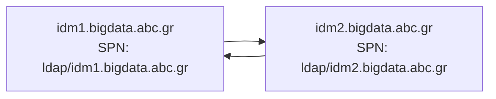

This document outlines the setup and operational procedures for managing FreeIPA (IDM) replication between two nodes. It also includes detailed troubleshooting steps for resolving SPN-related Kerberos preauthentication errors and replication failures across KDCs.
# Manage IDM Replication
## Setup
IDM (FreeIPA) has been installed on two nodes for High Availability. Replication between the two nodes is performed on the LDAP service using GSSAPI authentication (Kerberos) using `ldap/_HOST` Service Principal Names (SPNs). It is a "push" replication, so each change is propagated to the other instance from the instance that it was performed.
Each KDC uses the LDAP on the same host as backend, so since both LDAP Servers are replicated between the two instances (active-active) KDCs are up to date with between the two hosts.

## Procedure
### Check replication
``` bash
# Assuming you are on idm1
kinit <admin user>
ipa-replica-manage list -v # List replication targets of idm1
ipa-replica-manage list -v idm2.bigdata.abc.gr # This will connect to idm2 and show if it managed to push it's changes to the local instance (idm1)
```
```log
idm1.bigdata.abc.gr: replica
  last update status: Error (0) Replica acquired successfully: Incremental update succeeded
  last update ended: 2023-12-21 12:41:17+00:00
```
### Force replication
``` bash
# Assuming you are on idm1
kinit <admin user>
ipa-replica-manage force-sync  --from idm2.bigdata.abc.gr # This will connect to idm2 and schedule an immediate sync (push) to the local instance (idm1)
```
```log
ipa: INFO: Setting agreement cn=meToidm1.bigdata.abc.gr,cn=replica,cn=dc\=bigdata\,dc\=abc\,dc\=gr,cn=mapping tree,cn=config schedule to 2358-2359 0 to force synch
ipa: INFO: Deleting schedule 2358-2359 0 from agreement cn=meToidm1.bigdata.abc.gr,cn=replica,cn=dc\=bigdata\,dc\=abc\,dc\=gr,cn=mapping tree,cn=config
ipa: INFO: Replication Update in progress: FALSE: status: Error (0) Replica acquired successfully: Incremental update succeeded: start: 0: end: 0
```
## Troubleshooting
:warning: All problems in this section have been solved and all actions mentioned below have been reverted as part of obss/oss/sysadmin-group/abc/BigStreamer/bigstreamer#53 
### A brief history of preauthentication
Preauthentication is authentication of the client to the KDC when requesting a Kerberos ticket. This means that instead of issuing an `AS-REQ` the client issues a `TGS-REQ` which is logged in KDCs' logs.
We will not include specific preauthentication protocols in this presentation. Feel free to research them.
### Troubleshooting Preauthentication Issues
_At the time of writing we cannot replicate the issue to get accurate log entries, but we can give you is accurate commands for the investigation_ :smile:
When we failed over the Cloudera Services from `CNE.abc.GR` to `BIGDATA.abc.GR` we faced a problem with users coming from `CNE.abc.GR` not being able to login to Cloudera Services.
To resolve the issue we issued the following command, that disables preauthentication for SPNs:
```bash
# Assuming you are on idm1 and have valid admin Kerberos ticket
ipa config-mod --ipaconfigstring="KDC:Disable Default Preauth for SPNs"
```
This resolved our issue, but created two new problems:
1. SPNs do not require preauthentication, but `krbtgt/BIGDATA.abc.GR` requires preauthentication. This means that if you `kinit` with an SPN `kinit -R` will refuse to run with the dreaded `NO_PREAUTH`. This is problematic for the Hue Kerberos Renewer. As a workaround we are renewing the Kerberos ticket cache of Hue via `cron`.
2. Replication from `idm2.bigdata.abc.gr` to `idm1.bigdata.abc.gr`. The error is the error is also `NO_PREAUTH`. This means that `ldap/idm2.bigdata.abc.gr` was rejected by `ldap/idm1.bigdata.abc.gr` due to the lack of preauthentication. Let's inspect the service principals:
```bash
ipa service-find ldap/idm1.bigdata.abc.gr --all --raw
```
```log
    -----------------
    1 service matched
    -----------------
      dn: krbprincipalname=ldap/idm1.bigdata.abc.gr@BIGDATA.abc.GR,cn=services,cn=accounts,dc=bigdata,dc=abc,dc=gr
      krbcanonicalname: ldap/idm1.bigdata.abc.gr@BIGDATA.abc.GR
      krbprincipalname: ldap/idm1.bigdata.abc.gr@BIGDATA.abc.GR
      ...
      managedby: fqdn=idm1.bigdata.abc.gr,cn=computers,cn=accounts,dc=bigdata,dc=abc,dc=gr
      ipaKrbPrincipalAlias: ldap/idm1.bigdata.abc.gr@BIGDATA.abc.GR
      ...
      krbPwdPolicyReference: cn=Default Service Password Policy,cn=services,cn=accounts,dc=bigdata,dc=abc,dc=gr
      krbTicketFlags: 128
      memberof: cn=replication managers,cn=sysaccounts,cn=etc,dc=bigdata,dc=abc,dc=gr
      objectClass: ipaobject
      objectClass: top
      objectClass: ipaservice
      objectClass: pkiuser
      objectClass: krbprincipal
      objectClass: krbprincipalaux
      objectClass: krbTicketPolicyAux
      objectClass: ipakrbprincipal
    ----------------------------
    Number of entries returned 1
    ----------------------------
```
```bash
ipa service-find ldap/idm2.bigdata.abc.gr --all --raw
```
```log
    -----------------
    1 service matched
    -----------------
      dn: krbprincipalname=ldap/idm2.bigdata.abc.gr@BIGDATA.abc.GR,cn=services,cn=accounts,dc=bigdata,dc=abc,dc=gr
      krbcanonicalname: ldap/idm2.bigdata.abc.gr@BIGDATA.abc.GR
      krbprincipalname: ldap/idm2.bigdata.abc.gr@BIGDATA.abc.GR
      ...
      managedby: fqdn=idm2.bigdata.abc.gr,cn=computers,cn=accounts,dc=bigdata,dc=abc,dc=gr
      ipaKrbPrincipalAlias: ldap/idm2.bigdata.abc.gr@BIGDATA.abc.GR
      ...
      krbPwdPolicyReference: cn=Default Service Password Policy,cn=services,cn=accounts,dc=bigdata,dc=abc,dc=gr
      krbTicketFlags: 0
      memberof: cn=replication managers,cn=sysaccounts,cn=etc,dc=bigdata,dc=abc,dc=gr
      objectClass: ipaobject
      objectClass: top
      objectClass: ipaservice
      objectClass: pkiuser
      objectClass: krbprincipal
      objectClass: krbprincipalaux
      objectClass: krbTicketPolicyAux
      objectClass: ipakrbprincipal
    ----------------------------
    Number of entries returned 1
    ----------------------------
```
`krbTicketFlags` seems to be different. Checking the same principals from `kadmin` interface:
```bash
kadmin.local -q "get_principal ldap/idm1.bigdata.abc.gr"
```
```log
    Principal: ldap/idm1.bigdata.abc.gr@BIGDATA.abc.GR
    Expiration date: [never]
    ...
    Attributes: REQUIRES_PRE_AUTH
    Policy: [none]
```
```bash
kadmin.local -q "get_principal ldap/idm2.bigdata.abc.gr"
```
```log
    Principal: ldap/idm2.bigdata.abc.gr@BIGDATA.abc.GR
    Expiration date: [never]
    ...
    Attributes:
    Policy: [none]
```
Seems that preauthentication is enforced via `krbTicketFlags`. We can remove it by issuing the following command:
```bash
kadmin.local -q "modify_principal -requires_preauth ldap/idm1.bigdata.abc.gr" # This is also replicated to idm2, since pushing from idm1 to idm2 worked
```
Now replication works.
### Re-enable SPN Preauthentication (Post-Migration Cleanup)
When `CNE.abc.GR` is removed we will re-enable preauthentication with the following command to resolve the issue with Hue:
```bash
kadmin.local -q "modify_principal +requires_preauth ldap/idm1.bigdata.abc.gr"
ipa config-mod --ipaconfigstring=""
ipactl restart
```