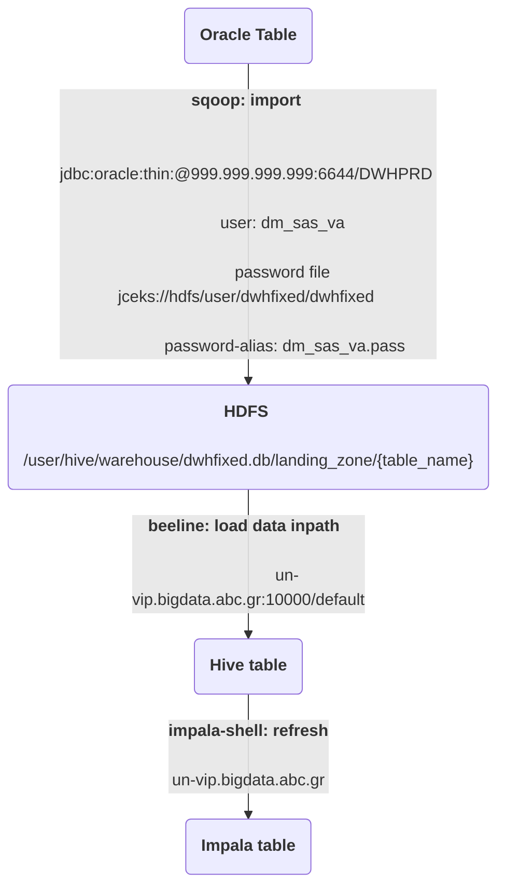
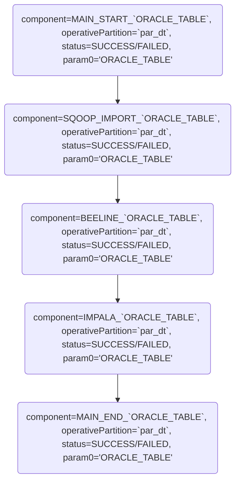

[[_TOC_]]

# 1. Full

- **USER**: `dwhfixed`
- **HUE WORKFLOW**: `DWHFixed - Full Workflow`, 
- **COORDINATOR**: `DWHFixed - Full Coordinator`
- **HDFS path**: `/user/dwhfixed/full`
- **Runs**: `15:30, 18:30 (UTC)` 
- **Config file**: `hdfs: /user/dwhfixed/dwhfixed.config`
- **Tables config/list**: `hdfs: /user/dwhfixed/full/tables_full.config`
- **Oracle user**: `dm_sas_va`
- **Oracle pass**: `https://metis.ghi.com/obss/oss/sysadmin-group/support/-/blob/master/KnowledgeBase/abc/devpasswd.kdbx`. You need password to open this file and get the user's password.

Moves data from the source tables to a `yesterday` partition of the target tables.

## 1.1. Oracle Tables (source)

- `SAS_VA_VIEW.V_BOX_DIM`
- `SAS_VA_VIEW.V_FIXED_CABLE_DIM`
- `SAS_VA_VIEW.V_KV_DIM`
- `SAS_VA_VIEW.V_DSLAM_DIM`
- `SAS_VA_VIEW.V_SR_TYPE_DIM`
- `SAS_VA_VIEW.V_SRIA_ADDINFO_DIM`
- `SAS_VA_VIEW.V_SRIA_STATUS_DIM`
- `SAS_VA_VIEW.V_SRIA_SERV_PRODUCT_CAT_DIM`
- `SAS_VA_VIEW.V_SRIA_PRIORITY_DIM`
- `SAS_VA_VIEW.V_PROVIDER_DIM`
- `SAS_VA_VIEW.V_def_NETWORK_DIM`
- `SAS_VA_VIEW.V_def_DIVISION_DIM`
- `SAS_VA_VIEW.V_SRIA_TYPE_DIM`
- `SAS_VA_VIEW.V_SRIA_ACT_STATUS_DIM`
- `SAS_VA_VIEW.V_SRIA_SUBAREA_DIM`
- `SAS_VA_VIEW.V_POSITION_DIM`
- `SAS_VA_VIEW.V_CAUSE_DIM`
- `SAS_VA_VIEW.V_ACTION_DIM`
- `SAS_VA_VIEW.V_ADSL_DIM`
- `SAS_VA_VIEW.V_SRIA_AREA_DIM`


## 1.2. Hive - Impala Tables (target)

- `dwhfixed.v_box_dim_hist`
- `dwhfixed.v_fixed_cable_dim_hist`
- `dwhfixed.v_kv_dim_hist`
- `dwhfixed.v_dslam_dim_hist`
- `dwhfixed.v_sr_type_dim_hist`
- `dwhfixed.v_sria_addinfo_dim_hist`
- `dwhfixed.v_sria_status_dim_hist`
- `dwhfixed.v_sria_serv_product_cat_dim_hist`
- `dwhfixed.v_sria_priority_dim_hist`
- `dwhfixed.v_provider_dim_hist`
- `dwhfixed.v_def_network_dim_hist`
- `dwhfixed.v_def_division_dim_hist`
- `dwhfixed.v_sria_type_dim_hist`
- `dwhfixed.v_sria_act_status_dim_hist`
- `dwhfixed.v_sria_subarea_dim_hist`
- `dwhfixed.v_position_dim_hist`
- `dwhfixed.v_cause_dim__hist`
- `dwhfixed.v_action_dim_hist`
- `dwhfixed.v_adsl_dim_hist`
- `dwhfixed.v_sria_area_dim_hist`


## 1.3. Data Flow



## 1.4. Logs

Application logs can be found in each Workflow in Hue as user `dwhfixed`. Oozie Coordinator result can be seen into HUE (login as `dwhfixed` user) and go to `Jobs -> Workflows` and look for `DWHFixed - Full Workflow`

## 1.5. Monitoring messages

- All monitoring messages have the following constant values:\
  **application=DWHFIXED**\
  **job=FULL**
- All monitoring messages of the same execution have a **unique executionId**
- Every component of one execution has a unique row that is updated between the following status values: RUNNING to SUCCESS or FAILED.



- Check monitoring app for successful executions:  
  
  From `un2` with personal account:

 ``` bash
curl --location --request GET 'http://un-vip.bigdata.abc.gr:12800/monitoring/api/jobstatus/find?application=DWHFIXED&job=FULL$status=SUCCESS&operativePartition=<timestamp e.g.:20220518>'
  ```

- Check monitoring app for failed executions:  
  
  From `un2` with personal account:

 ``` bash
curl --location --request GET 'http://un-vip.bigdata.abc.gr:12800/monitoring/api/jobstatus/find?application=DWHFIXED&job=FULL$status=FAILED&operativePartition=<timestamp e.g.:20220518>'
  ```

 - Get all the available fields [here](https://metis.ghi.com/obss/bigdata/common-dev/apps/monitoring/monitoring-devops/-/wikis/API-Functional-Spec#fields)

### 1.5.1. Grafana dashboard

Grafana: `https://unc1.bigdata.abc.gr:3000/d/DNM-sBo4z/dwhfixed-dashboard?orgId=1&from=now-2d&to=now`

## 1.6. Alerts (Mail)

**Subject**: `DWHFIXED - FULL: FAILED`  
**Body**: 
- `${ORACLE_TABLE}: failed to perform Oracle query.\nTime: ${datetime_now}`
- `${ORACLE_TABLE}: to connect or execute impala-shell query.\nTime: ${datetime_now}`
- `${ORACLE_TABLE}: failed to fetch data through Sqoop.\nTime: ${datetime_now}`
- `${ORACLE_TABLE}: fetched no data through Sqoop.\nTime: ${datetime_now}`
- `${ORACLE_TABLE}: failed to execute beeline query.\nTime: ${datetime_now}`
- `${ORACLE_TABLE}: to connect or execute impala-shell query.\nTime: ${datetime_now}`

`${ORACLE_TABLE}`: Can be any of the tables from section `1.1. Oracle (source)`  
`${datetime_now}`: Current datetime in `%Y-%m-%d %H:%M` format

The application sends an email in each case of the following failures (for each table):

### 1.6.1 Oracle failure

- Sqoop eval failure.
- Sqoop import failure.
- Sqoop has fetched no data.


How to check Oracle:
```
ssh <username>@un2
sh -l intra
jsec_file=jceks://hdfs/ez/intra.Sqoop.Creds.jceks
sqoop eval \
-Dhadoop.security.credential.provider.path=${jsec_file} \
--password-alias dm_sas_va.pass \
--connect jdbc:oracle:thin:@999.999.999.999:6644/DWHPRD \
--username dm_sas_va \
--query "select * FROM SAS_VA_VIEW.V_DW_CONTROL_TABLE where 1=1" ;
```
Alternative way of checking Oracle:
```
ssh <username>@undt1
su -l intra
export ORACLE_HOME=/usr/lib/oracle/11.2/client64
export LD_LIBRARY_PATH=$ORACLE_HOME/lib:${LD_LIBRARY_PATH}
export PATH=$ORACLE_HOME/bin:${PATH}
export SQLPATH=$ORACLE_HOME/lib:${SQLPATH}
export NLS_DATE_FORMAT='yyyy-mm-dd hh24:mi:ss'
export HISTSIZE=0
sqlplus dm_sas_va/<Oracle-pass>@999.999.999.999:6644/DWHPRD
```

### 1.6.2 Hive/Impala failure

- Beeline load data inpath has failed.
- Impala refresh has failed.


How to check Hive/Impala:
- In the Hue UI mentioned above, click on editor -> Hive/Impala
- Run the following query on each:`select * from dwhfixed.v_sria_subarea_dim_hist limit 3;`

### 1.6.3 Actions

//TODO


# 2. Delta

- **USER**: `dwhfixed`
- **HUE WORKFLOW**: `DWHFixed - Delta Workflow`, 
- **COORDINATOR**: `DWHFixed - Delta Coordinator`
- **HDFS path**: `/user/dwhfixed/delta`
- **Runs**: `1:30,3:30,5:30,7:30,9:30,11:30,13:30,15:30,19:30,21:30,23:30 (UTC)`
- **Config file**: `hdfs: /user/dwhfixed/dwhfixed.config`
- **Tables config/list**: `hdfs: /user/dwhfixed/delta/tables_delta.config`
- **Oracle user**: `dm_sas_va`
- **Oracle pass**: `https://metis.ghi.com/obss/oss/sysadmin-group/support/-/blob/master/KnowledgeBase/abc/devpasswd.kdbx`. You need password to open this file and get the user's password.


Runs every 2h, checks control table: `SAS_VA_VIEW.V_DW_CONTROL_TABLE` in order to evaluate if a new partition has been added to the source tables. After that, it runs data flow.

## 2.1. Oracle (source)

- `SAS_VA_VIEW.V_SRIA_SERVICE_REQUESTS_FCT`
- `SAS_VA_VIEW.V_ACS_MODEMS_ACTIVE_FCT`
- `SAS_VA_VIEW.V_LL_DIM`
- `SAS_VA_VIEW.V_SRIA_INTERACT_ACTIVITY_FCT`
- `SAS_VA_VIEW.V_DW_CONTROL_TABLE`
- `SAS_VA_VIEW.V_FAULT_NTT_NETWORK_ELEM_FCT`
- `SAS_VA_VIEW.V_SRIA_SITE_DIM`
- `SAS_VA_VIEW.V_SR_AFF_CUST_FCT`

## 2.2. Hive - Impala (target)

- `dwhfixed.v_sria_service_requests_fct_hist`
- `dwhfixed.v_acs_modems_active_fct_hist`
- `dwhfixed.v_ll_dim_hist`
- `dwhfixed.v_sria_interact_activity_fct_hist`
- `dwhfixed.v_fault_ntt_network_elem_fct_hist`
- `dwhfixed.v_sria_site_dim_hist`
- `dwhfixed.v_sr_aff_cust_fct_hist`


## 2.3. Data Flow


## 2.4. Logs

Application logs can be found in each Workflow in Hue as user `dwhfixed`. Oozie Coordinator result can be seen into HUE (login as `dwhfixed` user) and go to `Jobs -> Workflows` and look for `DWHFixed - Delta Workflow`

## 2.5. Monitoring messages

- All monitoring messages have the following constant values:\
  **application=DWHFIXED**\
  **job=DELTA**
- All monitoring messages of the same execution have a **unique executionId**
- Every component of one execution has a unique row that is updated between the following status values: RUNNING to SUCCESS or FAILED.


- Check monitoring app for successful executions:  
  
  From `un2` with personal account:

 ``` bash
curl --location --request GET 'http://un-vip.bigdata.abc.gr:12800/monitoring/api/jobstatus/find?application=DWHFIXED&job=DELTA$status=SUCCESS&operativePartition=<timestamp e.g.:20220518>'
  ```

- Check monitoring app for failed executions:  
  
  From `un2` with personal account:

 ``` bash
curl --location --request GET 'http://un-vip.bigdata.abc.gr:12800/monitoring/api/jobstatus/find?application=DWHFIXED&job=DELTA$status=FAILED&operativePartition=<timestamp e.g.:20220518>'
  ```

 - Get all the available fields [here](https://metis.ghi.com/obss/bigdata/common-dev/apps/monitoring/monitoring-devops/-/wikis/API-Functional-Spec#fields)
 
### 2.5.1. Grafana dashboard

Grafana: `https://unc1.bigdata.abc.gr:3000/d/DNM-sBo4z/dwhfixed-dashboard?orgId=1&from=now-2d&to=now`

## 2.6. Alerts (Mail)

**Subject**: `DWHFIXED - DELTA: FAILED`  
**Body**: 
- `${ORACLE_TABLE}: failed to perform Oracle query.\nTime: ${datetime_now}`
- `${ORACLE_TABLE}: to connect or execute impala-shell query.\nTime: ${datetime_now}`
- `${ORACLE_TABLE}: failed to fetch data through Sqoop.\nTime: ${datetime_now}`
- `${ORACLE_TABLE}: fetched no data through Sqoop.\nTime: ${datetime_now}`
- `${ORACLE_TABLE}: failed to execute beeline query.\nTime: ${datetime_now}`
- `${ORACLE_TABLE}: to connect or execute impala-shell query.\nTime: ${datetime_now}`

`${ORACLE_TABLE}`: Can be any of the tables from section `1.1. Oracle (source)`  
`${datetime_now}`: Current datetime in `%Y-%m-%d %H:%M` format


The application sends an email in each case of the following failures (for each table):

### 2.6.1 Oracle failure

- Sqoop eval failure.
- Sqoop import failure.
- Sqoop has fetched no data.


How to check Oracle:
```
ssh <username>@un2
sh -l intra
jsec_file=jceks://hdfs/ez/intra.Sqoop.Creds.jceks
sqoop eval \
-Dhadoop.security.credential.provider.path=${jsec_file} \
--password-alias dm_sas_va.pass \
--connect jdbc:oracle:thin:@999.999.999.999:6644/DWHPRD \
--username dm_sas_va \
--query "select * FROM SAS_VA_VIEW.V_DW_CONTROL_TABLE where 1=1" ;
```
Alternative way of checking Oracle:
```
ssh <username>@undt1
su -l intra
export ORACLE_HOME=/usr/lib/oracle/11.2/client64
export LD_LIBRARY_PATH=$ORACLE_HOME/lib:${LD_LIBRARY_PATH}
export PATH=$ORACLE_HOME/bin:${PATH}
export SQLPATH=$ORACLE_HOME/lib:${SQLPATH}
export NLS_DATE_FORMAT='yyyy-mm-dd hh24:mi:ss'
export HISTSIZE=0
sqlplus dm_sas_va/<Oracle-pass>@999.999.999.999:6644/DWHPRD
```

### 2.6.2 Hive/Impala failure

- Beeline load data inpath has failed.
- Impala refresh has failed.


How to check Hive/Impala:
- In the Hue UI mentioned above, click on editor -> Hive/Impala
- Run the following query on each:`select * from dwhfixed.v_sria_subarea_dim_hist limit 3;`

### 2.6.3 Actions

In case of any of alert, do nothing. The flow will try to re-run in 2 hours. If everything is OK, then it will load successfully the partitions. After 2-2:30 hours check the status of the next run. 

If the error persists:
- In case of infastructure error (ex. HDFS, Hive are down), do nothing.
- In case of other error, contact BigData Developer team.

# 3. HDFS Log Files Retention 
Archiving of the log files produced in every run of the flow and store them in HDFS directory.  
It is useful for investigation in case of errors.  
The retention of the log files is configurable. Default value: 9 days  

- **USER**: `dwhfixed`
- **HUE WORKFLOW**: `DWHFixed - HDFS_Log_Retention_Workf`, 
- **COORDINATOR**: `DWHFixed - HDFS_Log_Retention_Coord`
- **Runs**: `${coord:days(1)} 23:00 (Europe/Athens)`
- **HDFS Retention path**: `/user/dwhfixed/HDFS_LOG_Retention`
- **HDFS Log path**: `/user/dwhfixed/log`
- **HDFS Log Files**: `DWHFIXED.*.Archive.tar.gz`

# 4. Useful Links

[Home](https://metis.ghi.com/obss/bigdata/abc/alarm-archiving/dwhfixed/-/wikis/home)
[Infrastructure](https://metis.ghi.com/obss/bigdata/abc/alarm-archiving/dwhfixed/-/wikis/Infrastructure)
