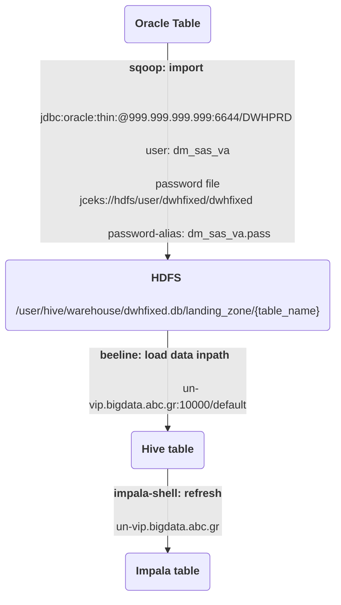

# DWHFixed Flow

## 1. Overview

`DWHFixed Flow` is a data pipeline that moves data from Oracle source tables to Hive-Impala target tables using Sqoop. The pipeline has two workflows: **Full Workflow**, which runs twice a day, and **Delta Workflow**, which runs every two hours.

**Key Information**
- **User:** `dwhfixed`
- **Execution Schedule:** 
  - **Full Workflow:** `15:30, 18:30 UTC`
  - **Delta Workflow:** Every 2 hours
- **Primary Storage:** HDFS
- **Data Processing Framework:** Sqoop, Beeline, Impala
- **Log Storage:** HDFS (`/user/dwhfixed/log`)
- **Primary Scripting Language:** Shell & SQL
- **Monitoring System:** MySQL, Grafana

## 2. Installation & Configuration

### 2.1. Scripts & Configuration
#### Data Sources
- **Oracle Database**
  - **User:** `dm_sas_va`
  - **Password:** [Stored securely](https://metis.ghi.com/obss/oss/sysadmin-group/support/-/blob/master/KnowledgeBase/abc/devpasswd.kdbx)
  - **Source Tables:** Listed in **Data Processing** section

- **HDFS Directories**
  - **Full Workflow Path:** `/user/dwhfixed/full`
  - **Delta Workflow Path:** `/user/dwhfixed/delta`
  - **Log Path:** `/user/dwhfixed/log`
  - **Landing Zone:** `/user/hive/warehouse/dwhfixed.db/landing_zone/`

#### Scripts & Configuration Location
- **Configuration File:** `hdfs:/user/dwhfixed/dwhfixed.config`
- **Full Workflow Tables Config:** `hdfs:/user/dwhfixed/full/tables_full.config`
- **Delta Workflow Tables Config:** `hdfs:/user/dwhfixed/delta/tables_delta.config`

#### Oozie Scheduling
- **Full Workflow**
  - **Hue Workflow Name:** `DWHFixed - Full Workflow`
  - **Coordinator Name:** `DWHFixed - Full Coordinator`
  - **Execution Time:** `15:30, 18:30 UTC`
- **Delta Workflow**
  - **Hue Workflow Name:** `DWHFixed - Delta Workflow`
  - **Coordinator Name:** `DWHFixed - Delta Coordinator`
  - **Execution Time:** Every 2 hours

#### Database CLI Commands
- **Sqoop Eval:**  

sqoop eval
-Dhadoop.security.credential.provider.path=jceks://hdfs/ez/intra.Sqoop.Creds.jceks
--password-alias dm_sas_va.pass
--connect jdbc:oracle:thin:@999.999.999.999:6644/DWHPRD
--username dm_sas_va
--query "select * FROM SAS_VA_VIEW.V_DW_CONTROL_TABLE where 1=1";

- **Beeline:**  

beeline -u "jdbc:hive2://un-vip.bigdata.abc.gr:10000/default"

- **Impala:**  

impala-shell -i un-vip.bigdata.abc.gr -d dwhfixed --ssl -k


## 3. Data Processing

### 3.1. Full Workflow
- Moves data from Oracle source tables to `yesterday` partition in Hive-Impala target tables.
- **Data Flow:**

### 3.2. Delta Workflow

    Runs every 2 hours, checking SAS_VA_VIEW.V_DW_CONTROL_TABLE for new partitions.
    If a new partition is found, it moves incremental data.
    
## 4. Monitoring & Debugging

### 4.1. Logs
- **Log Location:** `/user/dwhfixed/log`
- **Retrieve logs from HDFS:**

hdfs dfs -get /user/dwhfixed/log/DWHFIXED.<execution ID>.tar.gz


### 4.2. Monitoring
- **Check monitoring app for success:**

curl --location --request GET 'http://un-vip.bigdata.abc.gr:12800/monitoring/api/jobstatus/find?application=DWHFIXED&job=FULL&status=SUCCESS'

- **Check for failures:**

curl --location --request GET 'http://un-vip.bigdata.abc.gr:12800/monitoring/api/jobstatus/find?application=DWHFIXED&job=FULL&status=FAILED'

- **Grafana Dashboard:**  

https://unc1.bigdata.abc.gr:3000/d/DNM-sBo4z/dwhfixed-dashboard


## 5. Troubleshooting

### Common Errors & Fixes
- **Sqoop Import Failure**
- Validate Oracle connection credentials.
- Ensure `dm_sas_va.pass` is correctly configured.
- **Hive Load Failure**
- Verify HDFS permissions.
- Check Beeline execution logs.
- **Impala Refresh Failure**
- Manually refresh tables:
  ```
  impala-shell -i un-vip.bigdata.abc.gr -d dwhfixed --ssl -k -q "INVALIDATE METADATA dwhfixed.v_box_dim_hist;"
  ```
- **Recurring Failures**
- If failure persists, allow the next scheduled execution to attempt re-processing.
- If multiple failures occur, contact the **BigData Developer Team**.

## 6. Data Validation & Checks

### 6.1. Monitoring Components

+-----------------+------------------------------+------------------+ | execution_id | component | status | +-----------------+------------------------------+------------------+ | 20230420_230010 | SQOOP_IMPORT_V_BOX_DIM | SUCCESS | | 20230420_230010 | BEELINE_LOAD_V_BOX_DIM | SUCCESS | +-----------------+------------------------------+------------------+


### 6.2. Automated Alerts
- **Email Subject:** `DWHFIXED - FULL: FAILED`
- **Possible Errors:**
  - Oracle connection failure
  - Impala refresh failure
  - Data inconsistency in HDFS

## 7. Miscellaneous Notes

- Ensure Sqoop jobs execute successfully before triggering Beeline.
- Check logs frequently for debugging.
- In case of persistent failures, escalate to the **BigData Developer Team**.
- **HDFS Log Retention:** Logs are archived for **9 days** under `/user/dwhfixed/HDFS_LOG_Retention`.

