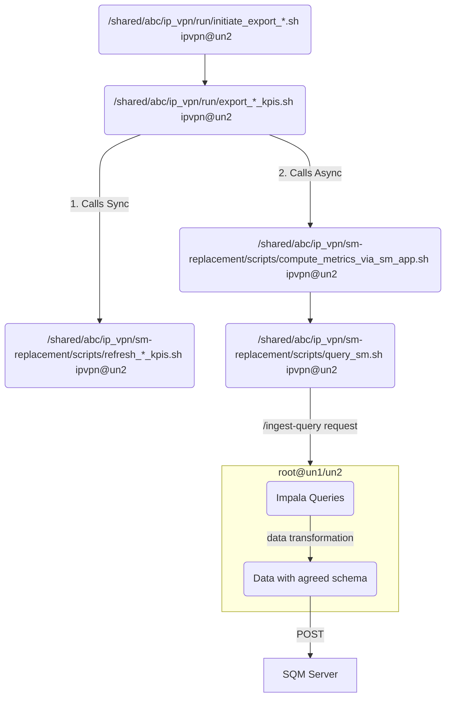

# IPVPN-SM Replacement Process

## 1. Overview
This support document outlines the steps that compose the IPVPN-SM replacement process that computes Key Performance Indicators (KPIs) regarding the network quality of abc. The ETL process involves a series of scripts and a Spring Boot application that work together to retrieve, transform, and load data from Impala tables into a remdef server.

There are three major KPI categories: **Components**, **SLA**, and **Interfaces**, which consist of the following subcategories:

| KPI category | Metrics involved | Relevant Impala tables |
|-------------|-----------------|------------------------|
| Components  | CPU, Memory (MEM) | bigcust.nnm_ipvpn_componentmetrics_hist, nnmnps.nms_node |
| Interfaces  | Interfaces (IF) | bigcust.perf_interfacemetrics_ipvpn_hist, bigcust.pe_interfaces, nnmnps.nms_node |
| SLA         | Availability (AV), Quality of Service (QOS) | bigcust.nnmcp_ipvpn_slametrics_hist, bigcust.customer_pl, bigcust.customer_sla_config_ipvpn, bigcust.sla_configurations |

---

## 2. Installation & Configuration

### Scripts & IPVPN-SM App Operations
The metrics computation of each of the three categories (SLA, components, interfaces) is triggered by the `un2:/shared/abc/ip_vpn/run/initiate_export_*.sh` script that runs as part of the IPVPN-SLA [cronjob](https://metis.ghi.com/obss/bigdata/abc/ipvpn/ip-vpn-sla/ipvpnsla-customers-devops/-/blob/master/PROD/crontab/crontab_per_user.txt), scheduled to run every 5 minutes.

### IPVPN-SM Application
The IPVPN-SM Application executes the Impala queries specified in the `/shared/abc/ip_vpn/sm-app/deployment/config/field-mappings.yml`, applies transformations on the result set based on the agreed [schema specifications](https://metis.ghi.com/obss/bigdata/abc/ipvpn/ip-vpn-sla/ipvpn-sm-devops/-/wikis/Data-Transmission-Schema), and sends the results to the SQM server.

#### Ingestion Endpoint
The endpoint for the IPVPN-SM application is `/ingest-query`. This endpoint should be called with a POST request.

#### Check application status:

curl --location --request GET 'un-vip:13001/ipvpn-sm/app/status'

## 3. Data Processing

### Application Flow Diagram


### Infrastructure
- **Deployment path**: `/shared/abc/ip_vpn/sm-app/deployment`
- **Configuration**: `/shared/abc/ip_vpn/sm-app/deployment/config`
- **Logs**: `/shared/abc/ip_vpn/sm-app/deployment/logs`
- **Impala**: `un-vip.bigdata.abc.gr:21050`
- **Hive database**: `bigcust`
- **Authentication**: Kerberos
- **HAProxy Load Balancer**: `un-vip:13001`
- **Application Servers**: `un1/un2`
- **SQM Server**: `gw-prod-sqm.aksprd.abc.gr:443`

---

## 4. Monitoring & Debugging

### Logs
- **Script Logs**: `/shared/abc/ip_vpn/sm-replacement/log`
- **Application Logs**:
  - `/shared/abc/ip_vpn/sm-app/deployment/logs/tomcat/access_log.log`
  - `/shared/abc/ip_vpn/sm-app/deployment/logs/application.log`
  - `/shared/abc/ip_vpn/sm-app/deployment/logs/sm-server-requests.log`
- **Monitoring Dashboard**:  
  - [Grafana Dashboard](https://unc1.bigdata.abc.gr:3000/d/HiuaKlU4z/ipvpn-sm-replacement-monitoring?orgId=1&refresh=5s)

### Checking Failed Requests
```bash
mysql -umonitoring -p -h 999.999.999.999
use monitoring;
select * from jobstatus where application="IPVPN-SM" and status="FAILED" and system_ts >= now() - INTERVAL 1 DAY;
```

---

## 5. Troubleshooting

### Common Errors & Fixes

#### **AppEmptyQueryException**
- This happens when the executed Impala query returns no data.
- **Solution:** Manually re-run the request using:
```bash
./sm-replacement-call-repeater.sh CPU 202212181010 202212181010
```

#### **SMSystemException**
- Happens when the SQM server rejects data ingestion.
- **Solution:** Manually resubmit using:
```bash
./sm-replacement-call-repeater.sh CPU 202212181010 202212181010
```

#### **SMAuthException**
- Authentication failure with SQM.
- **Solution:** Update the authentication token using:
```bash
keytool -importpass -alias sm_token -storetype JCEKS -validity 365000 -keystore credentials.keystore
```

---

## 6. Data Validation & Checks

### Verify Data in Impala
To check if data has been loaded properly, execute:
```bash
refresh nnmcp_ipvpn_slametrics_hist;
select count(*) from nnmcp_ipvpn_slametrics_hist where n5_minute='2023-11-28 11:20:00';
```

### Verify API Requests
To check failed requests sent to SQM, query the monitoring database:
```bash
select * from jobstatus where application="IPVPN-SM" and status="FAILED";
```

---

## 7. Miscellaneous Notes

### Manually Triggering Data Processing
If you need to manually process KPIs, run:
```bash
./sm-replacement-call-repeater.sh CPU 202212181010 202212181030
```

### Restarting the IPVPN-SM Application
For restarting the IPVPN-SM app, follow:
```bash
sudo systemctl restart ipvpn-sm
```

