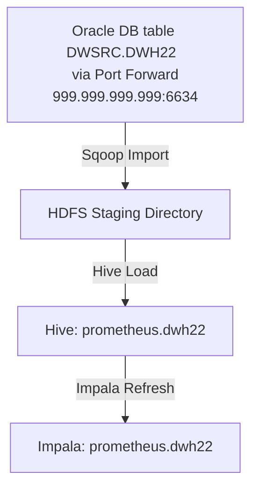

# Prometheus

## 1. Overview

The **Prometheus Flow** is responsible for importing data from an **Oracle DB table (DWSRC.DWH22)** into **Hive & Impala** using **Oozie**. The process is scheduled to run daily at `06:30 AM UTC`. It follows an **ETL workflow** using Sqoop to extract data, Hive to transform, and Impala to query efficiently.

---

## 2. Installation & Configuration

### Useful Links
- [Infrastructure](https://metis.ghi.com/obss/bigdata/abc/etl/prometheus/prometheus-devops/-/wikis/Infastructure)
- [Monitoring](https://metis.ghi.com/obss/bigdata/abc/etl/prometheus/prometheus-devops/-/wikis/home#monitoring)

### Oozie Workflow

- **Schedule**: Runs **daily at `06:30 AM UTC`**
- **User**: `prometheus`
- **Coordinator**: `Prometheus-Coordinator`
- **Workflow**: `Prometheus-Import-Workflow`

### Source Database
- **Host**: `999.999.999.999`
- **Port**: `1521`
- **SID**: `A7`
- **User**: `bigstreamer`

### Target Table
- **Hive Table**: `prometheus.dwh22`
- **Impala Table**: `prometheus.dwh22`
- **HDFS Installation Directory**: `/user/prometheus/flows`
- **HDFS Staging Directory**: `/ez/warehouse/prometheus.db/tmp_sqoop_jobs/`

---

## 3. Data Processing

1. **Extract**:  
   - The **Oracle database** table `DWSRC.DWH22` is queried using **Sqoop**, and data is exported to **HDFS**.
2. **Transform**:  
   - The extracted data is loaded into the **Hive table** `prometheus.dwh22`.
3. **Load**:  
   - The Hive table is refreshed and optimized in **Impala** for faster queries.

---

## 4. Monitoring & Debugging

### Alerts
- If the process **fails**, an **email alert** is sent with the subject:  
  **`Prometheus Flow failed`**

### Check Monitoring Application Logs
1. **Check for Successful Executions**
    ```bash
    curl --location --request GET 'http://un-vip.bigdata.abc.gr:12800/monitoring/api/jobstatus/find?application=PROMETHEUS&status=SUCCESS&operativePartition=<timestamp e.g.:20220518>'
    ```
2. **Check for Failed Executions**
    ```bash
    curl --location --request GET 'http://un-vip.bigdata.abc.gr:12800/monitoring/api/jobstatus/find?application=PROMETHEUS&status=FAILED&operativePartition=<timestamp e.g.:20220518>'
    ```
3. **Additional Debugging**
    - [Check all available fields](https://metis.ghi.com/obss/bigdata/common-dev/apps/monitoring/monitoring-devops/-/wikis/API-Functional-Spec#fields)
    - **Grafana Dashboard**:  
      [Prometheus Monitoring](https://unc1.bigdata.abc.gr:3000/d/PcKYyfTVz/prometheus-dashboard?orgId=1&from=now-2d&to=now)

### Check if Partition is Loaded
Run the following queries in **Impala Editor (Hue)**:
```sql
SHOW PARTITIONS prometheus.dwh22;
SELECT COUNT(*) FROM prometheus.dwh22 WHERE par_dt='<par_dt>';
```

### Check Logs for Failed Steps
1. **Open Hue**
2. **Go to Workflows**
3. **Search for `Prometheus-Import-Workflow`**
4. **Filter for `Failed` Jobs**
5. **Check logs (stdout & stderr)**

---

## 5. Troubleshooting

### Common Issues & Fixes

| Issue | Cause | Fix |
|-------|-------|-----|
| **Partition partially inserted** | Error in the previous day's import | **Drop & Reload the Partition** |
| **Hive/Impala queries failing** | Inconsistent data or missing partitions | **Re-run the import workflow** |
| **Oozie workflow failure** | Failed step in Sqoop or Hive load | **Check logs & re-run the workflow** |

### Fix: Drop and Reload a Partition
Run the following in **Impala Editor (Hue)**:
```sql
ALTER TABLE prometheus.dwh22 DROP IF EXISTS PARTITION (par_dt='<par_dt>');
```

### Re-run Import Workflow for Yesterday’s Data
1. Open **Hue**
2. **Go to Workflows**
3. Search for `Prometheus-Import-Workflow`
4. Filter for **Failed**
5. **Re-run the workflow**

### Re-run Import Workflow for Older Partitions
1. Open **Hue**
2. **Go to File Browser**
3. Edit `/user/prometheus/flows/config/settings_prod.ini`
4. Set:
   ```ini
   days_back = <number_of_days_needed>
   ```
5. **Re-run the workflow**
6. **Restore `days_back = 1` in `settings_prod.ini`**

---

## 6. Data Validation & Checks

### Validate Data in Hive/Impala
Run the following in **Impala Editor (Hue)**:
```sql
SELECT * FROM prometheus.dwh22 WHERE par_dt='<par_dt>' LIMIT 10;
```
Ensure the partition data is available.

---

## 7. Miscellaneous Notes

- The **Prometheus Flow** runs **daily** at **06:30 AM UTC**.
- If **no new data** is found, the job exits without execution.
- Regular **Impala table optimizations** help improve query performance.
- **Monitoring logs** should be checked **daily** for failures.

