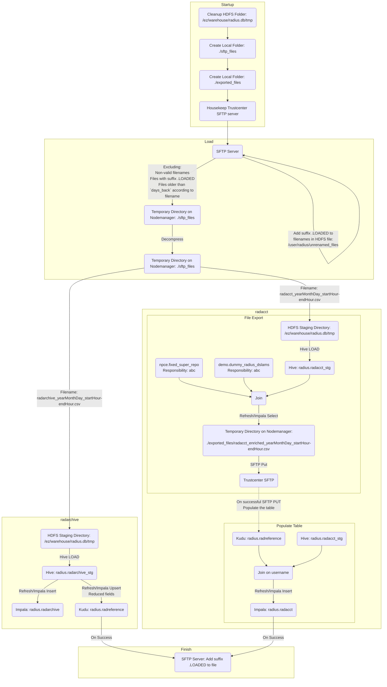
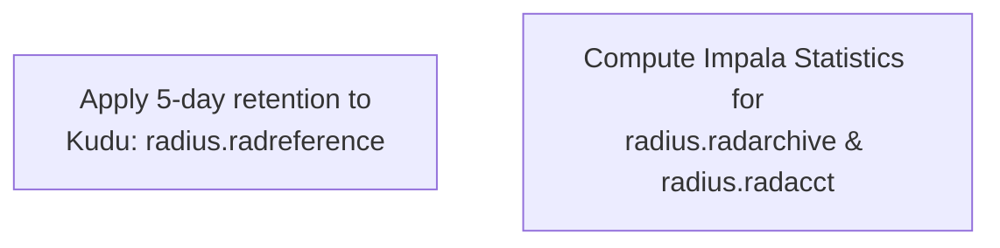

# Radius

## 1. Overview

The **Radius Flow** is responsible for ingesting **SFTP files**, loading them into **Hive & Impala**, and exporting **processed files** back to a Trustcenter SFTP server. The process is scheduled to run every **1 hour and 30 minutes**. It follows an **ETL workflow** to extract, transform, and load network authentication records.

---

## 2. Installation & Configuration

### Main Flow


- **User**: `radius`  
- **Coordinator**: `Radius_Load_Coordinator`  
- **Workflow**: `Radius_Load_Workflow`
- **HDFS path**: `/user/radius`
- **Runs**: `every 1 hour and 30 minutes`
- **Config file**: `HDFS: /user/radius/config/settings_prod.ini`
- **Logs**: Check `Job Browser -> Workflows` in Hue  
- **Input SFTP Server**:
  - **Host**: `999.999.999.999`
  - **Port**: `22`
  - **User**: `prdts`
  - **Files Folder**: `/home/prdts/transfer`
  - **Port Forward**:  
    - **Host**: `un-vip.bigdata.abc.gr`
    - **Port**: `2222`
- **Trustcenter SFTP Server**:
  - **Host**: `unc2.bigdata.abc.gr`
  - **Port**: `22`
  - **User**: `trustcenterftp`
  - **Files Folder**: `/rd`

---

## 3. Data Processing

1. **Extract**:  
   - The **SFTP files** are retrieved and temporarily stored in `/sftp_files`
   - Files are **decompressed** and moved to `/ez/warehouse/radius.db/tmp`
2. **Transform**:  
   - The extracted data is loaded into **Hive tables**:
     - `radius.radarchive_stg`
     - `radius.radacct_stg`
   - **Impala Refresh** optimizes queries
3. **Load**:  
   - Data is inserted into:
     - `radius.radarchive`
     - `radius.radacct`
   - Processed files are exported via **SFTP Put** back to the **Trustcenter SFTP Server**

---

## 4. Monitoring & Debugging

### Alerts
- **Subject:** `Radius Flow failed`
- **Potential Errors**:
  - **Input SFTP Server Issues**:
    - `No upcoming files for more than 3h`
    - `Files found with a late timestamp`
    - `Could not rename file`
  - **Trustcenter SFTP Issues**:
    - `Could not perform radacct_enriched housekeeping`
  - **General Failures**:
    - `Insert data failed`

### Check Monitoring Application Logs
1. **Check for Failed Executions**
    ```bash
    curl --location --request GET 'http://un-vip.bigdata.abc.gr:12800/monitoring/api/jobstatus/find?application=RADIUS&status=FAILED&operativePartition=<YYYYMMDD>'
    ```
2. **Grafana Dashboard**:  
   - [Radius Monitoring](https://unc1.bigdata.abc.gr:3000/d/J4KPyBoVk/radius-dashboard?orgId=1&from=now-2d&to=now)

3. **Check Hue Logs**
   - `Job Browser -> Workflows`
   - Filter for `Radius_Load_Workflow`
   - Check **stdout & stderr**

---

## 5. Troubleshooting

### Common Issues & Fixes

| Issue | Cause | Fix |
|-------|-------|-----|
| **Missing SFTP files** | SFTP connectivity issues | Check with `sftp prdts@999.999.999.999` |
| **Trustcenter SFTP failures** | Network errors | Verify `unc2.bigdata.abc.gr` |
| **Insert Data Failed** | Data formatting errors | Check logs & re-run the job |

### Manually Reload a Partition
1. **Ensure Files Exist on SFTP Server**
    ```bash
    sftp prdts@999.999.999.999
    ls -l *.LOADED
    ```
2. **Suspend Coordinator**
    ```bash
    oozie job -suspend <Radius_Load_Coordinator>
    ```
3. **Drop Affected Partitions**
    ```sql
    ALTER TABLE radius.radarchive DROP PARTITION (par_dt="<YYYYMMDD>");
    ALTER TABLE radius.radacct DROP PARTITION (par_dt="<YYYYMMDD>");
    ```
4. **Rename SFTP Files for Reload**
    ```bash
    sftp> rename <filename>.LOADED <filename>
    ```
5. **Resume Coordinator**
    ```bash
    oozie job -resume <Radius_Load_Coordinator>
    ```

---

## 6. Kudu Housekeeping & Compute Statistics



- **User**: `radius`  
- **Coordinator**: `Radius_Kudu_Retention_Coordinator`  
- **Workflow**: `Radius_Kudu_Retention_Workflow`
- **Runs**: `Once a day at 02:25 UTC`
- **Config file**: `HDFS: /user/radius/Kudu_Retention_And_Compute_Stats/settings.ini`
- **Logs**: Check **Hue -> Workflows**

### Alerts
- **Not monitored**

### Troubleshooting
- Check logs for failure
- After fixing issues, the next execution will **automatically** apply corrections

---

## 7. Miscellaneous Notes

- The **Radius Flow** runs **every 1h 30min**.
- Data **older than 5 days** is **automatically cleaned** from Kudu.
- **Monitoring logs** should be checked **daily** for failures.

