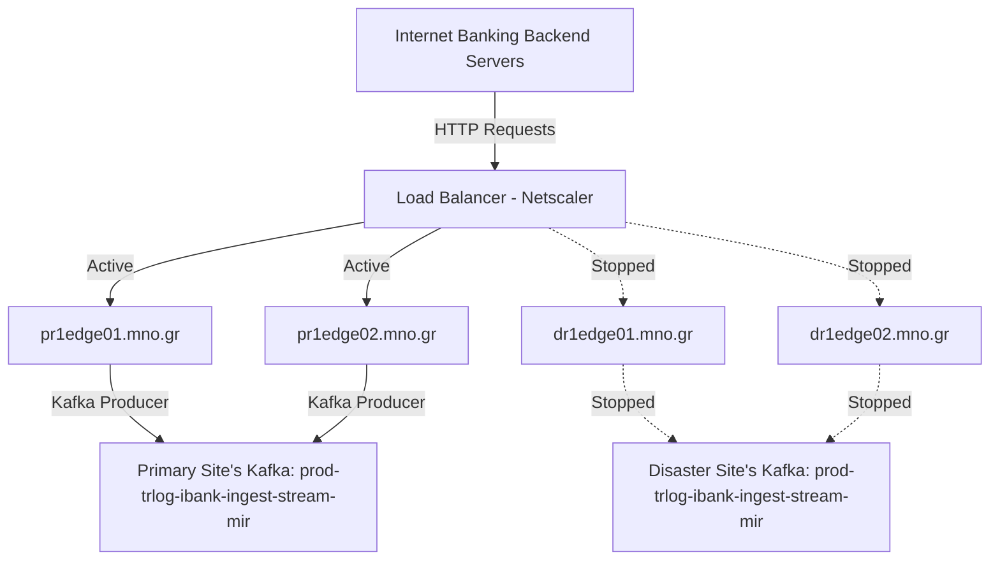
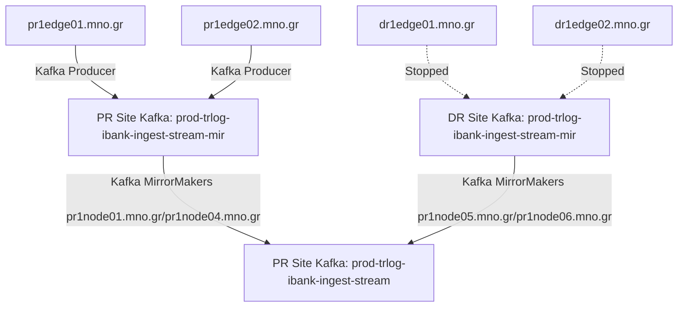
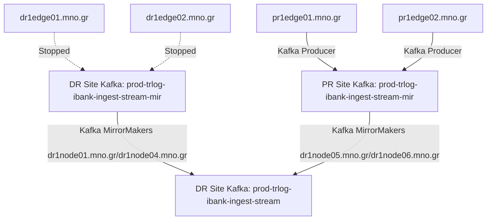
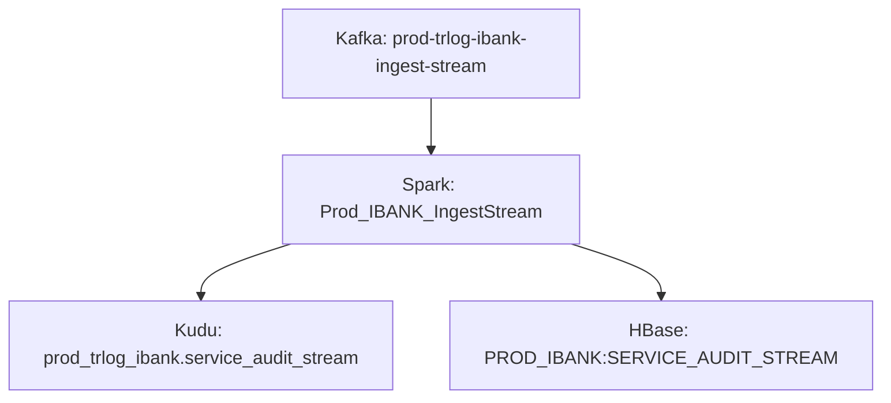
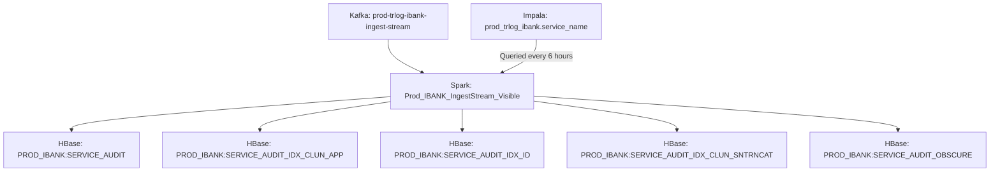
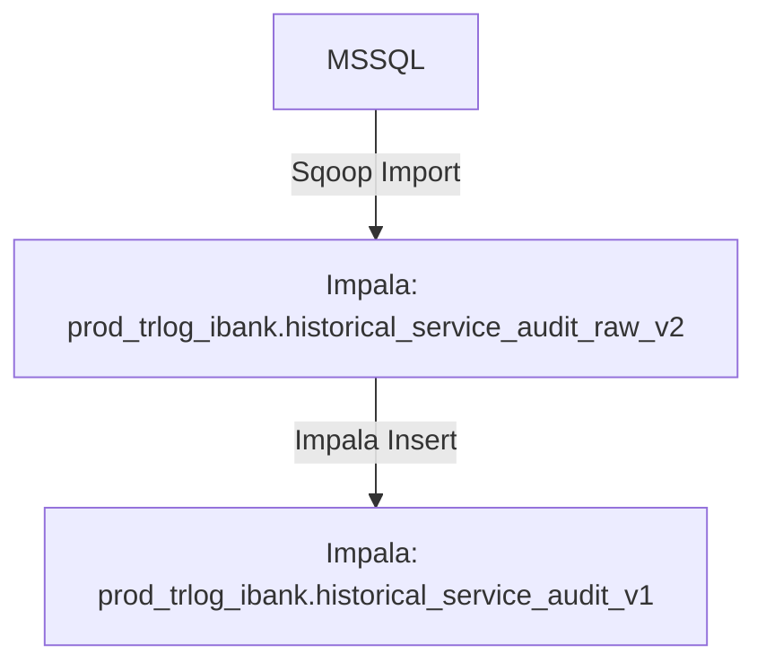
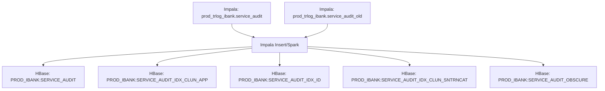

# Internet Banking

## 1. Overview

The Datawarehouse iBank system is responsible for extracting, processing, and exporting transaction details from the `prod_trlog_ibank.service_audit` table into multiple analytical tables. The processing pipeline uses Apache Spark for extraction and Apache Sqoop for exporting data to the MSSQL Data Warehouse. The execution of jobs is managed via UC4 agent installed on the BDA edge node.

## 2. Installation & Configuration
### Scripts & Configuration


####  Oozie Jobs

#####  Lookup tables
Every day (at 07:15 by Oozie on DR & PR site ), we transfers 3 tables with reference data from the legacy MSSQL server, which is managed by mno, to the cluster. We keep only latest version to BigData (no partition).

**User**: `PRODREST`

**Coordinator**: `Coord_IbankLookupTables_PROD`

**Workflow**: `ImportLookupTables`

**Local path**: `/opt/ingestion/PRODREST/hdfs_mirror/lookupTables/import_lookup_tables.sh`

**Logs**: from HUE

**Alerts**:

- **Not Monitored**

**Troubleshooting Steps**:

- Open Hue to find coordinator status and logs


#####  Create next week kudu partitions
Every day (at 10:00 by Oozie on DR site and 10:40 by Oozie on PR site ), we delete old Kudu partitions and add new Kudu partitions on `prod_trlog_ibank.service_audit_stream`.

**User**: `PRODREST`

**Coordinator**: `Coord_IBankCreateKuduPartitionsPROD`

**Workflow**: `CreateKuduPartitionsPROD`

**Local path**: `/opt/ingestion/PRODREST/hdfs_mirror/create_kudu_partition/create_next_weeks_partitions.sh`

**Logs**: from HUE

**Alerts**:

- **Not Monitored**

**Troubleshooting Steps**:

- Open Hue to find coordinator status and logs

There is a case that merge batch has not properly run for a specific date, **even though** the transactions for that specific date are present on impala `service_audit`. For example by moving a service_audit partiton from DR to PR or vice versa, or when merge batch failed **after** deleting transactions from kudu.

In that case we can manually mark merge batch as complete for that date, and therefore next oozie job created by `Coord_IBankCreateKuduPartitionsPROD` will delete that partition from kudu, by manipulating HBase table `PROD_IBANK:MERGE_BATCH_STATE_INFO`.

Example for a specific date (10/10/2022):
 - Run HBase shell
 ```
   hbase shell
   ```
 - And then inside HBase shell:
 ```
   put 'PROD_IBANK:MERGE_BATCH_STATE_INFO', 'MergeBatchInfoKey_20221010', 'MergaBatchState:drop_hbase', 'true'
   put 'PROD_IBANK:MERGE_BATCH_STATE_INFO', 'MergeBatchInfoKey_20221010', 'MergaBatchState:drop_hbase_time','0'
   put 'PROD_IBANK:MERGE_BATCH_STATE_INFO', 'MergeBatchInfoKey_20221010', 'MergaBatchState:drop_kudu', 'true'
   put 'PROD_IBANK:MERGE_BATCH_STATE_INFO', 'MergeBatchInfoKey_20221010', 'MergaBatchState:drop_kudu_time', '0'
   put 'PROD_IBANK:MERGE_BATCH_STATE_INFO', 'MergeBatchInfoKey_20221010', 'MergaBatchState:running', 'false'
   put 'PROD_IBANK:MERGE_BATCH_STATE_INFO', 'MergeBatchInfoKey_20221010', 'MergaBatchState:running+time', '0'
   put 'PROD_IBANK:MERGE_BATCH_STATE_INFO', 'MergeBatchInfoKey_20221010', 'MergaBatchState:write_impala', 'true'
   put 'PROD_IBANK:MERGE_BATCH_STATE_INFO', 'MergeBatchInfoKey_20221010', 'MergaBatchState:write_impala_time', '0'
   ```
   
###### DEV
Every day (at **11:10 by Oozie** on **DR site only** ), we delete old Kudu partitions and add new Kudu partitions on `dev_trlog_ibank.service_audit_stream`.

**User**: `DEVREST`

**Coordinator**: `Coord_IBankCreateKuduPartitionsDEV`

**Workflow**: `CreateKuduPartitionsDEV`

**Local path**: `/opt/ingestion/DEVREST/hdfs_mirror/create_kudu_partition/create_next_weeks_partitions.sh`

**Logs**: from HUE

**Alerts**:

- **Not Monitored**

## 3. Data Processing

### Stream

#### Wilfly

User generated events are sent to Wildfly instances installed at edge servers as HTTP POST requests. The requests originate from the backend servers of Internet Banking. Requests are loadbalanced by NetScaler (Loadbalancer) that is managed by mno's networking department. The events are then sent to a Kafka topic. Usually only one site is active (Primary Site).



**User**: `PRODREST`

**Installation Path**: `/opt/wildfly/default/prodrestib`

**Deployments Path**: `/opt/wildfly/default/prodrestib/standalone/deployments`

**General Configuration Path**: `/opt/wildfly/default/prodrestib/standalone/configuration/standalone.xml`

**Application Configuration Path**: `/opt/wildfly/default/prodrestib/standalone/configuration/BigStreamer/beanconfig/translogApiIBankJmxConfig.xml`

**Application Logs**: `/var/log/wildfly/prodrestib/server.log`

**Access Log**: `/var/log/wildfly/prodrestib/access.log`

**Instructions for start/stop**: [Here](../procedures/manage_wildfly.md)

**Instructions for migrating traffic to DR site**: [Here](../procedures/failover.md)

**Alerts**:

- [PR][IBANK] REST Endpoints Average Response Time
- [DR][IBANK] REST Endpoints Average Response Time
- [PR][IBANK] Ingestion Average Error rate
- [DR][IBANK] Ingestion Average Error rate

**Troubleshooting Steps**:

- Check application logs for error messages.
- In case there are many errors in the application logs, try to restart the problematic Wildfly instance with the provided instructions.
- If the logs do not indicate a specific problem, check for any problems regarding Kafka performance.

#### Kafka Mirrorring

After being published to Kafka, the traffic is mirrored to the opposite site via Kafka MirrorMaker. In order to be able to have both Sites active at any given time and simplify the failover procedure the each Site produce messages to a topic with the suffix `-mir`. The topics with the `-mir` suffix contain events published to the Site. The `-mir` topics are then copied via Kafka MirrorMakers to the final topics (no `-mir` suffix), that has all the messages from both Sites.

##### PR replication



##### DR replication



**MirrorMaker User**: `kafka`

**Configuration**: Cloudera Manager

**Logs**: Cloudera Manager

**Instructions for start/stop**: [Here](../procedures/manage_mirrormaker.md)

**Alerts**:

- Cloudera Manager alerts regarding Kafka

#### Spark Streaming

After being sent to the final Kafka topic, the records are consumed by two separate Spark Streaming topologies

##### Prod_IBANK_IngestStream

This topology takes all records from the final Kafka topics, extracts some values and writes them to a Kudu table. It also inserts some columns that are too big for Kudu to an HBase table. This topology runs independently **on both clusters**.



**User**: `PRODREST`

**Logs**: Use Firefox on `dr1edge01.mno.gr`/`pr1edge01.mno.gr` to access the logs via YARN Resource Manager UI

**Submit Script**: `/opt/ingestion/PRODREST/ibank/spark/submit/submitmnoSparkTopology_stream_cluster_mno_STABLE.sh` on `dr1edge01.mno.gr`/`pr1edge01.mno.gr` (each edge server submits to a different cluster)

**Alerts**:

- [PR][IBANK] Spark Waiting Batches
- [DR][IBANK] Spark Waiting Batches

**Troubleshooting Steps**:

- If the alert chart has **no line**, ensure that the application is not running (Cloudera Manager > YARN > Applications) and then submit the topology using the **Submit Script**. After resubmitting the application check the old application logs for the root cause that it failed
- If the alert has exceeded the threshold, investigate HBase/Kudu for delays and check the application logs for any errors. You can also try to kill (use Cloudera Manager or yarn command) and then re-submit the topology.

#### Prod_IBANK_IngestStream_Visible

**Visible transaction**: Visible are considered transactions from applications that have show_customer marked as true in the Impala table `prod_trlog_ibank.service_name`.

This topology takes **visible** records from the final Kafka topics and writes them to HBase tables. This topology runs independently **on both clusters**.



**User**: `PRODREST`

**Logs**: Use Firefox on `dr1edge01.mno.gr`/`pr1edge01.mno.gr` to access the logs via YARN Resource Manager UI

**Submit Script**: `/opt/ingestion/PRODREST/ibank/spark/submit/submitmnoSparkTopology_stream_cluster_mno_VISIBLE_STABLE.sh` on `dr1edge01.mno.gr`/`pr1edge01.mno.gr` (each edge server submits to a different cluster)

**Alerts**:

- [PR][IBANK Visible] Spark Waiting Batches
- [DR][IBANK Visible] Spark Waiting Batches

**Troubleshooting Steps**:

- If the alert chart has **no line**, ensure that the application is not running (Cloudera Manager > YARN > Applications) and then submit the topology using the **Submit Script**.
- If the alert has exceeded the threshold, investigate HBase for delays and check the application logs for any errors. You can also try to kill (use Cloudera Manager or yarn command) and then re-submit the topology.

### Batch

#### Main script

As mentioned before, the information processed by the [Prod_IBANK_IngestStream](#prod_ibank_ingeststream) topology is stored in Kudu/HBase tables. At the end of each day (at **1:00 am in PR site** and **2:00 am in DR site** by **Cron**) the records from HBase/Kudu is enriched with additional information and the transfered to a parquet table. After the data are inserted to the parquet table, sequent jobs are triggered to produce aggregations and data for external systems. This procedure runs **independantly on both sites**.

**User**: `PRODREST`

**Logs**: `/var/log/ingestion/PRODREST/ibank/log/ibank_histMigrate_aggr_MergeBatchWithLock_v2.log`

**Script**: `/opt/ingestion/PRODREST/historical/ibank_histMigrate_aggr_MergeBatchWithLock_STABLE_v2.sh` on `dr1edge01.mno.gr`/`pr1edge01.mno.gr` (each edge server submits to a different cluster)

**Alerts**:

- _See below_

**Troubleshooting Steps**:

This procedure runs multiple steps which we will describe below with seperate troubleshooting steps for each step. Use the following steps for all alarms as a general guide:

- Identify the failed step using the alarm name
- Identify the root cause for the failed job based on the logs of the submit script/cluster application/query
- If the problem is with an external system, ask the customer to inform the owners of the external system
- if the problem is temporary or if you cannot determine the root cause of the problem, try to re-run the failed application

#### Sub-steps

The following steps run **on both clusters independently**, unless specified otherwise.

##### MSSQL Sqoop Import (Migration)

This step transfers transactions from the legacy MSSQL server, which is managed by mno, to the cluster as part of the daily data migration from the legacy system.



**User**: `PRODREST`

**Script Logs**: ```/opt/icomdev/ibank_hist/prod_migrate/sqoop_`date +%Y%m%d`_1_1_`date +%Y%m%d_%H%M`.log```

**Sqoop Logs**: Use Firefox on `dr1edge01.mno.gr`/`pr1edge01.mno.gr` to access the logs via YARN Resource Manager UI

**Script**: `/opt/ingestion/PRODREST/historical/ibank_migration/sqoop_import_ibank_hist_recursive_prod_STABLE.sh` on `dr1edge01.mno.gr`/`pr1edge01.mno.gr` (each edge server submits to a different cluster)

**Alerts**:

- IBank_Migration Historical JOB
- IBank_Migration Historical Sqoop_Import
- IBank_Migration Historical Impala_Insert

**Troubleshooting Steps**:

- Use the script/sqoop logs to identify the cause of the failure
- If the alert is Sqoop_Import, you can safely execute the script again
  - For the previous day:

    ``` bash
    /opt/ingestion/PRODREST/historical/ibank_migration/sqoop_import_ibank_hist_recursive_prod_STABLE.sh /mno_data/hive/warehouse/prod_trlog_ibank.db/landing_zone/import_historical_service_audit_raw_v2 FandFUser prod_trlog_ibank.historical_service_audit_raw_v2 prod_trlog_ibank.historical_service_audit_v1 `date +%Y-%m-%d` 1 1 4 jceks://hdfs/user/PRODREST/migration/credentials/mssql_ibank.jceks mssqlprod.password >>  /opt/icomdev/ibank_hist/prod_migrate/sqoop_`date +%Y%m%d`_1_1_`date +%Y%m%d_%H%M`.log 2>&1
    ```

  - For a specified date:

    ``` bash
    # eg. 10-11-2019
    nohup /opt/ingestion/PRODREST/historical/ibank_migration/sqoop_import_ibank_hist_recursive_prod_STABLE.sh /mno_data/hive/warehouse/prod_trlog_ibank.db/landing_zone/import_historical_service_audit_raw_v2 FandFUser prod_trlog_ibank.historical_service_audit_raw_v2 prod_trlog_ibank.historical_service_audit_v1 2019-11-10 1 1 4 jceks://hdfs/user/PRODREST/migration/credentials/mssql_ibank.jceks mssqlprod.password &>>  /opt/icomdev/ibank_hist/prod_migrate/sqoop_20191110_1_1_20191112_0900.log &
    ```

- If the alert is Impala_Insert, check the that the records from the MSSQL server and the `prod_trlog_ibank.historical_service_audit_raw_v2` have the same count
  - MSSQL server

    ``` bash
    # Replace the sample date 16/11/2019-17/11/2019
	source /opt/ingestion/PRODREST/historical/ibank_migration/config
    sqoop-eval  -Dhadoop.security.credential.provider.path=jceks://hdfs/user/PRODREST/migration/credentials/mssql_ibank.jceks --connect 'jdbc:jtds:sqlserver://999.999.999.999:2544;useNTLMv2=true;databaseName=InternetBankingAudit' --username FandFUser --password-alias mssqlprod.password --query "select count() from ServiceAudit WITH (nolock, INDEX(IX_ServiceAuditNew_Timestamp)) where Timestamp >= '2019-11-16 00:00:00' and Timestamp < '2019-11-17 00:00:00'"
    ```

  - prod_trlog_ibank.historical_service_audit_raw_v2

    ``` bash
    impala-shell -k --ssl -i ${HOSTNAME/01/} -q "select  count(*) from prod_trlog_ibank.historical_service_audit_raw_v2;"
    ```

- In case the counts are different between the two try again with Hive:
  - prod_trlog_ibank.historical_service_audit_raw_v2

    ``` bash
    # For Primary Site
    beeline -u "jdbc:hive://pr1edge.mno.gr:10000/default;principal=hive/_HOST@BDAP.mno.GR;ssl=true" -e "select  count(*) from prod_trlog_ibank.historical_service_audit_raw_v2;"
    # For Disaster Site
    beeline -u "jdbc:hive://dr1edge.mno.gr:10000/default;principal=hive/_HOST@BDAD.mno.GR;ssl=true" -e "select  count(*) from prod_trlog_ibank.historical_service_audit_raw_v2;"
    ```

- If the counts are the same with Hive:

  ``` bash
  # For Primary Site
  beeline -u "jdbc:hive://pr1edge.mno.gr:10000/default;principal=hive/_HOST@BDAP.mno.GR;ssl=true"
  # For Disaster Site
  beeline -u "jdbc:hive://dr1edge.mno.gr:10000/default;principal=hive/_HOST@BDAD.mno.GR;ssl=true"
  ```

  And run the insert:

  ``` SQL
  INSERT INTO prod_trlog_ibank.historical_service_audit_v1 partition (par_dt) SELECT id, to_timestamp(trtimestamp, 'yyyy-MM-dd HH:mm:ss.SSSSSSS'), trim(host), trim(servicename), trim(type), trim(application), cast(substr(executiontime,1,2)as BIGINT)36001000000000 + castsubstr(executiontime,4,2)as BIGINT)601000000000+ cast(substr(executiontime,7,2)as BIGINT)*1000000000 + cast(substr(executiontime,10,7)as BIGINT)*100, clientsession, trim(clientusername), cast(clientcustomer AS bigint), clientipadress, clientdetails, trim(clientrequestpath), cast(clientlongitude AS FLOAT), cast(clientlatitude AS FLOAT), cast(substr(clientexecutiontime,1,2)as BIGINT)36001000000000 + cast(substr(clientexecutiontime,4,2)as BIGINT)601000000000+ cast(substr(clientexecutiontime,7,2)as BIGINT)*1000000000 + cast(substr(clientexecutiontime,10,7)as BIGINT)*100, webhost, responsetextdata, requesttextdata, errordata, replace(to_date(trtimestamp),'-','') AS par_dt FROM prod_trlog_ibank.historical_service_audit_raw_v2;
  ```

  And then refresh the table

  ``` bash
  impala-shell -k --ssl -i ${HOSTNAME/01/} -q "SET DDL_SYNC=true; refresh prod_trlog_ibank.historical_service_audit_v1;"
  ```

- Run the rest of the steps

#### Insert to Service Audit

This step transfers transactions migrated from the legacy MSSQL server to the final table.

``` mermaid
  graph TD
  A[Impala: prod_trlog_ibank.historical_service_audit_v1] -->|Impala Insert| B[Impala: prod_trlog_ibank.service_audit]
  ```

**User**: `PRODREST`

**Script Logs**: `/var/log/ingestion/PRODREST/ibank/log/ibank_migrate_hist_to_service_audit.log`

**Script**: `/opt/ingestion/PRODREST/historical/ibank_migrate_hist_to_service_audit_STABLE.sh` on `dr1edge01.mno.gr`/`pr1edge01.mno.gr` (each edge server submits to a different cluster)

**Alerts**:

- IBank_Migration Historical to SA JOB
- IBank_Migration Historical to SA Impala_Insert

**Troubleshooting Steps**:

- Use the script logs to identify the cause of the failure
- The script cleans up after failure, so if the problem was temporary run the script again
  - For the previous day:

    ``` bash
    /opt/ingestion/PRODREST/historical/ibank_migrate_hist_to_service_audit_STABLE.sh prod_trlog_ibank.historical_service_audit_v1 prod_trlog_ibank.service_audit `date +%Y%m%d` 1 1 >> /var/log/ingestion/PRODREST/ibank/log/ibank_migrate_hist_to_service_audit.log  2>&1
    ```

  - For a specified date:

    ``` bash
    # eg. 09-11-2019 (Ndef that the argument is one day after the desired date)
    /opt/ingestion/PRODREST/historical/ibank_migrate_hist_to_service_audit_STABLE.sh prod_trlog_ibank.historical_service_audit_v1 prod_trlog_ibank.service_audit 20191110 1 1 >> /var/log/ingestion/PRODREST/ibank/log/ibank_migrate_hist_to_service_audit.log  2>&1 &
    ```

- Run the rest of the steps

##### Merge Batch

This step transfers transactions ingested by the [Stream](#stream) flow to an intermediate table and deletes the data from the original tables.

``` mermaid
  graph TD
  A[Kudu: prod_trlog_ibank.service_audit_stream] --> B[Spark: PROD_IBank_MergeBatch]
  C[HBase: PROD_IBANK:SERVICE_AUDIT_STREAM] --> B
  B --> D[Impala: prod_trlog_ibank.service_audit_old]
  ```

**User**: `PRODREST`

**Script Logs**: `/var/log/ingestion/PRODREST/ibank/log/cronExecutor_ibankBatch_full.log`

**Spark Logs**: Use Firefox on `dr1edge01.mno.gr`/`pr1edge01.mno.gr` to access the logs via YARN Resource Manager UI

**Script**: `/opt/ingestion/PRODREST/common/scripts/cronExecutor_MergeBatchWithLock_hdfs_STABLE.sh` on `dr1edge01.mno.gr`/`pr1edge01.mno.gr` (each edge server submits to a different cluster)

**Alerts**:

- IBank_Ingestion MergeBatch JOB

**Troubleshooting Steps**:

- Use the script/spark logs to identify the cause of the failure
- Ensure that no records are present in prod_trlog_ibank.service_audit_old

  ``` bash
  # eg. 09-11-2019
  impala-shell -k --ssl -i ${HOSTNAME/01/} -q "select  count(*) from prod_trlog_ibank.service_audit_old where par_dt='20191109';"
  ```

- If no records exist and no other process is up, you can ran the script again.
  - For the previous day:

    ``` bash
    /opt/ingestion/PRODREST/common/scripts/cronExecutor_MergeBatchWithLock_hdfs_STABLE.sh /user/PRODREST/lock/PROD_IBank_MergeBatch LOCK_IBANK_PROD_BATCH_MERGE_TRANS /opt/ingestion/PRODREST/ibank/spark/submit/submitmnoSparkTopology_batch_cluster_mno_STABLE.sh PROD_IBank_MergeBatch  /opt/ingestion/PRODREST/ibank/lock/ FULL 1800 "`date --date='-1 day' '+%Y-%m-%d 00:00:00'`" "`date '+%Y-%m-%d 00:00:00'`"   >> /var/log/ingestion/PRODREST/ibank/log/cronExecutor_ibankBatch_full.log 2>&1
    ```

  - For a specified date:

    ``` bash
    # eg. 09-11-2019
    /opt/ingestion/PRODREST/common/scripts/cronExecutor_MergeBatchWithLock_hdfs_STABLE.sh /user/PRODREST/lock/PROD_IBank_MergeBatch LOCK_IBANK_PROD_BATCH_MERGE_TRANS /opt/ingestion/PRODREST/ibank/spark/submit/submitmnoSparkTopology_batch_cluster_mno_STABLE.sh PROD_IBank_MergeBatch  /opt/ingestion/PRODREST/ibank/lock/ FULL 1800 "2019-11-09 00:00:00" "2019-11-10 00:00:00"   >> /var/log/ingestion/PRODREST/ibank/log/cronExecutor_ibankBatch_full.log 2>&1 &
    ```

- The process runs for well over an hour under normal circumstances or even longer for heavy load. Use of `screen` command advised
- If the problem is with resources (out-of-memory errors):
  - You can adjust the values at `/opt/ingestion/PRODREST/ibank/spark/submit/submitmnoSparkTopology_batch_cluster_mno_STABLE.sh`. At the moment these values are as high as they can go.
  - You can run the MergeBatch for parts of the day

    ``` bash
    # eg. 09-11-2019
    /opt/ingestion/PRODREST/ibank/spark/submit/submitmnoSparkTopology_batch_cluster_mno_STABLE.sh "2019-11-09 00:00:00" "2019-11-09 12:00:00"
    /opt/ingestion/PRODREST/ibank/spark/submit/submitmnoSparkTopology_batch_cluster_mno_STABLE.sh "2019-11-09 12:00:00" "2019-11-09 18:00:00"
    /opt/ingestion/PRODREST/ibank/spark/submit/submitmnoSparkTopology_batch_cluster_mno_STABLE.sh "2019-11-09 18:00:00" "2019-11-10 00:00:00"
    ```

- Run the rest of the steps

##### Distinct join to Service Audit

Some records that are ingested by the [Stream](#stream) can also be present in the MSSQL server. In this step we insert to the final table the transactions that are unique to the [Stream](#stream), excluding the ones that are already present in the final table due to the data migration by MSSQL.

``` mermaid
  graph TD
  A[Impala: prod_trlog_ibank.service_audit_old] -->|Impala Insert| B[Impala: prod_trlog_ibank.service_audit]
```

**User**: `PRODREST`

**Script Logs**: `/var/log/ingestion/PRODREST/ibank/log/ibank_service_audit_insert_join_distinct.log`

**Script**: `/opt/ingestion/PRODREST/historical/ibank_service_audit_insert_join_distinct.sh` on `dr1edge01.mno.gr`/`pr1edge01.mno.gr` (each edge server submits to a different cluster)

**Alerts**:

- IBank_Migration Enrich SA from SA_old JOB

**Troubleshooting Steps**:

- Use the script logs to identify the cause of the failure
- Ensure that only records coming from prod_trlog_ibank.historical_service_audit_v1 are present in prod_trlog_ibank.service_audit. These records come from Insert to Service Audit [sub-step](#insert-to-service-audit) and their number should match.

  ``` bash
  # eg. 09-11-2019
  impala-shell -k --ssl -i ${HOSTNAME/01/} -q "select  count(*) from prod_trlog_ibank.service_audit where par_dt='20191109';"
  impala-shell -k --ssl -i ${HOSTNAME/01/} -q "select  count(*) from prod_trlog_ibank.historical_service_audit_v1 where par_dt like '20191109';"
  ```

- If these records match and no other process is up, you can run the script again.
  - For the previous day:

    ``` bash
    /opt/ingestion/PRODREST/historical/ibank_service_audit_insert_join_distinct.sh `date -d '-1 day' '+%Y%m%d'` >> /var/log/ingestion/PRODREST/ibank/log/ibank_service_audit_insert_join_distinct.log 2>&1
    ```

  - For a specified date:

    ``` bash
    # e.g. 09-11-2019
    /opt/ingestion/PRODREST/historical/ibank_service_audit_insert_join_distinct.sh 20191109 >> /var/log/ingestion/PRODREST/ibank/log/ibank_service_audit_insert_join_distinct.log 2>&1
    ```

- Run the rest of the steps

##### Report stats to Graphite

Reports statistics about the ingestion process.

**User**: `PRODREST`

**Script Logs**: `/var/log/ingestion/PRODREST/ibank/log/cron_report_stats.log`

**Script**: `/opt/ingestion/PRODREST/common/scripts/report_stats_impala_STABLE.sh` on `dr1edge01.mno.gr`/`pr1edge01.mno.gr` (each edge server submits to a different cluster)

**Alerts**:

- **Not Monitored**

**Troubleshooting Steps**:

- This process is not monitored
- You can safely skip this step
- Sample execution:

  ``` bash
  nohup  /opt/ingestion/PRODREST/common/scripts/report_stats_impala_STABLE.sh prod_trlog_ibank.service_audit ibank >> /var/log/ingestion/PRODREST/ibank/log/cron_report_stats.log
  ```

- Run the rest of the steps

##### Trigger external flows

Ndef: **ONLY DR SITE**

Creates a trigger file for external flows. Related to [Datawerehouse](./ibank_dwh.md)

**User**: `PRODREST`

**Script Logs**: `-`

**Script**: `-`

**Alerts**:

- IBank_Migration Create UC4 file Create UC4 file

**Troubleshooting Steps**:

- Ensure that you are running steps for the DR site
- If you are running the steps for the Primary skip this step
- Execution:

  ``` bash
  touch /home/bank_central_mno_gr/datawarehouse_status/IBANK_SA_`date '+%Y%m%d'`.READY
  touch /opt/applications/landing_zone/PRODUSER/triggers/IBANK_SA_`date '+%Y%m%d'`.READY
  ```

- Run the rest of the steps

##### Drop hourly partitions

Ndef: **ONLY DR SITE**

Drop partitions from the [Hourly Merge Batch](#hourly-merge-batch) tables

**User**: `PRODREST`

**Script Logs**: `/var/log/ingestion/PRODREST/ibank/log/drop_hourly_partitions.log`

**Script**: `/opt/ingestion/PRODREST/common/scripts/drop_hourly_partitions_STABLE.sh`

**Alerts**:

- IBank_Migration Drop hourly partitions JOB

**Troubleshooting Steps**:

- Ensure that you are running steps for the DR site
- If you are running the steps for the Primary skip this step
- Use the script logs to identify the cause of the failure
- For the previous day:

  ``` bash
  nohup /opt/ingestion/PRODREST/common/scripts/drop_hourly_partitions_STABLE.sh "prod_trlog_ibank.service_audit_hourly" "`date -d '-1 day' '+%Y%m%d'`" >> /var/log/ingestion/PRODREST/ibank/log/drop_hourly_partitions.log 2>&1 &
  ```

- For a specified date:

  ``` bash
  # e.g. 09-11-2019
  nohup /opt/ingestion/PRODREST/common/scripts/drop_hourly_partitions_STABLE.sh "prod_trlog_ibank.service_audit_hourly" "20191109" >> /var/log/ingestion/PRODREST/ibank/log/drop_hourly_partitions.log 2>&1 &
  ```

- Run the rest of the steps

##### Execute aggregations

Ndef: **This flow is supspended. DO NOT EXECUTE**. Information listed here are for completeness.

This flow computes aggregations for use with the [Queries](#queries).

**User**: `PRODREST`

**Script Logs**: `/var/log/ingestion/PRODREST/ibank/log/update_ibank_aggr_tables.log`

**Script**: `/opt/ingestion/PRODREST/common/scripts/update_ibank_aggr_tables_STABLE.sh`

**Alerts**:

- IBank_Migration Aggregations JOB
- IBank_Migration Aggregations HBase
- IBank_Migration Aggregations Kudu

**Troubleshooting Steps**:

- **DO NOT RUN THIS STEP**
- For the previous day:

  ``` bash
  /opt/ingestion/PRODREST/common/scripts/update_ibank_aggr_tables_STABLE.sh prod_trlog_ibank.service_audit prod_trlog_ibank.aggr_service_audit_clun_app prod_trlog_ibank.aggr_service_audit_clun >> /var/log/ingestion/PRODREST/ibank/log/update_ibank_aggr_tables.log 2>&1
  ```

- For a specified date:

  ``` bash
  # e.g. 09-11-2019
  /opt/ingestion/PRODREST/common/scripts/update_ibank_aggr_tables_STABLE.sh prod_trlog_ibank.service_audit prod_trlog_ibank.aggr_service_audit_clun_app prod_trlog_ibank.aggr_service_audit_clun 20191109 >> /var/log/ingestion/PRODREST/ibank/log/update_ibank_aggr_tables.log 2>&1
  ```

- Run the rest of the steps


##### Upsert to HBase (Migration)

This step enriches the HBase visible tables with the transactions that are unique to MSSQL server.



**User**: `PRODREST`

**Script Logs**: `/var/log/ingestion/PRODREST/ibank/log/ibank_visible_trn_hbase_daily_upsert.log`

**Script**: `/opt/ingestion/PRODREST/common/scripts/ibank_visible_trn_hbase_daily_upsert_STABLE.sh`

**Alerts**:

- IBank_Migration Enrich hbase tables JOB
- IBank_Migration Enrich hbase tables Impala_insert
- IBank_Migration Enrich hbase tables Spark

**Troubleshooting Steps**:

- Use the script logs to identify the cause of the failure

  Ndef: If job failed and the following error appears :`ERROR: RetriesExhaustedWithDetailsException: Failed <num> actions: CallTimeoutException: <num> times, servers with issues: [dr/pr]1node02.mno.gr`,  execute script again. The error has to do with HBase merging/spliting on a region server, but a detailed reason is unknown.
- The script uses upsert and can be safely run many times.


  - For the previous day:

    ``` bash
    /opt/ingestion/PRODREST/common/scripts/ibank_visible_trn_hbase_daily_upsert_STABLE.sh `date -d '-1 day' '+%Y%m%d'`  >> /var/log/ingestion/PRODREST/ibank/log/ibank_visible_trn_hbase_daily_upsert.log 2>&1
    ```

  - For a specified date:

    ``` bash
    # e.g. 09-11-2019
    /opt/ingestion/PRODREST/common/scripts/ibank_visible_trn_hbase_daily_upsert_STABLE.sh 20191109  >> /var/log/ingestion/PRODREST/ibank/log/ibank_visible_trn_hbase_daily_upsert.log 2>&1
    ```

- Run the rest of the steps

##### Send reports to business users

Sends email reports to users for duplicate transaction IDS and leftover transactions in `prod_trlog_ibank.service_audit_stream`.

**User**: `PRODREST`

**Script Logs**: `-`

**Script**: `-`

**Alerts**:

- IBank_Migration GUID_Report JOB
- IBank_Migration GUID_Report Impala

**Troubleshooting Steps**:

- Check `/var/log/ingestion/PRODREST/ibank/log/ibank_report_duplicate_identical.log` for errors
- You can safely skip this step if not running for the previous day
- Sample execution:

   ``` bash
  /opt/ingestion/PRODREST/common/scripts/ibank_report_duplicate_identical_STABLE.sh  prod_trlog_ibank service_audit_old service_audit_duplicates >> /var/log/ingestion/PRODREST/ibank/log/ibank_report_duplicate_identical.log 2>&1 &
   ```

##### Duplicates between Impala and Kudu/HBase

Delete data which exist both Impala and Kudu. Sometimes MergeBatch fails because YARN kills executors for exceeding memory limits. AS a result, transactions are inserted to impala and job fails before drop them from kudu and HBase

**User**: `PRODREST`

**Script Logs**: `/var/log/ingestion/PRODREST/ibank/log/report_duplicates_kudu_hbase_impala.log`

**Script**: `/opt/ingestion/PRODREST/common/scripts/report_duplicates_kudu_hbase_impala_STABLE.sh`

**Alerts**:

- **Not Monitored**

**Troubleshooting Steps**:

- Check `/var/log/ingestion/PRODREST/ibank/log/report_duplicates_kudu_hbase_impala.log` for errors
- You can safely skip this step if not running for the previous day
- Sample execution:

  ``` bash
  /opt/ingestion/PRODREST/common/scripts/report_duplicates_kudu_hbase_impala_STABLE.sh `date --date='-1 day' '+%Y%m%d'` prod_trlog_ibank.service_audit_stream prod_trlog_ibank.service_audit_old ibank >> /var/log/ingestion/PRODREST/ibank/log/report_duplicates_kudu_hbase_impala.log 2>&1
  ```

- Run the rest of the steps

##### Update monitoring postgres database

Ndef: **IF AND ONLY IF**  all steps performed succesfully and grafana monitoring isn't updated, proceed with the following:

Updated the monitoring postgres database to appeared green/success in Grafana.

- For a specified date:

```bash
# e.g 2023-03-30
ssh Exxxx@pr1edge01.mno.gr
sudo -i -u postgres
psql -d monitoring
select * from prod.monitoring where par_dt = 20230330;
INSERT INTO prod.monitoring (application, job_name,component,status,par_dt,start_time,end_time,description,params,host) VALUES ('IBank_Migration','Enrich SA from SA_old','JOB',0,20230330,'2023-03-31 03:18:30.000','2023-03-31 05:00:42.000','','','pr1edge01.mno.gr') ON CONFLICT (application, job_name,component,par_dt) DO UPDATE SET status=0, start_time='2023-03-31 03:18:30.000', end_time='2023-03-31 05:00:42.000',description='';
```

- Check from Grafana that the failed job is now succeded


#### Hourly Merge Batch

Every hour a  transfers transactions ingested by the [Stream](#stream) flow to an intermediate table and without deleting the data from the original tables. This table is used by mno to query the latest transactions.

``` mermaid
  graph TD
  A[Kudu: prod_trlog_ibank.service_audit_stream] --> B[Spark: PROD_IBank_MergeBatch_Hourly]
  C[HBase: PROD_IBANK:SERVICE_AUDIT_STREAM] --> B
  B --> D[Impala: prod_trlog_ibank.service_audit_hourly]
  ```

**User**: `PRODREST`

**Spark Logs**: Use Firefox on `dr1edge01.mno.gr`/`pr1edge01.mno.gr` to access the logs via YARN Resource Manager UI

**Alerts**:

- **Not Monitored**

**Troubleshooting Steps**:

- Use the spark logs to identify the cause of the failure
- The data in the Hourly tables is only for the current day. No need to fill missing hours, as the next MergeBatch will insert the data to the final table.

## 4. Monitoring & Debugging
### Logs


#### Queries

The ingested data are queried in order to be displayed by the Internet Banking application (under the Calendar/Ημερολόγιο application). The application displays to the user only **Visible** transactions. The queries are submitted to the cluster as HTTP requests using the same Wildfly instances as the [Stream](#stream) flow.

```mermaid
  graph TD
  A[Internet Banking Backend Servers] -->|HTTP Requests| B[Load Balancer - Netscaler]
  B -->|Active| C[pr1edge01.mno.gr]
  B -->|Active| D[pr1edge02.mno.gr]
  B -.->|Stopped| E[dr1edge01.mno.gr]
  B -.->|Stopped| F[dr1edge02.mno.gr]
  C -->|Impala JDBC / HBase client| G[Primary Site]
  D -->|Impala JDBC / HBase client| G
  E -.->|Stopped| H[Disaster Site]
  F -.->|Stopped| H
```

**User**: `PRODREST`

**Installation Path**: `/opt/wildfly/default/prodrestib`

**Deployments Path**: `/opt/wildfly/default/prodrestib/standalone/deployments`

**General Configuration Path**: `/opt/wildfly/default/prodrestib/standalone/configuration/standalone.xml`

**Application Configuration Path**: `/opt/wildfly/default/prodrestib/standalone/configuration/BigStreamer/beanconfig/translogApiIBankJmxConfig.xml`

**Application Logs**: `/var/log/wildfly/prodrestib/server.log`

**Access Log**: `/var/log/wildfly/prodrestib/access.log`

**Instructions for start/stop**: [Here](../procedures/manage_wildfly.md)

**Instructions for migrating traffic to DR site**: [Here](../procedures/failover.md)

**Alerts**:

- [PR][IBANK] Query Average Response Time
- [DR][IBANK] Query Average Response Time
- [PR][IBANK] Query Average Error rate
- [DR][IBANK] Query Average Error rate

**Troubleshooting Steps**:

- Check in Grafana dashboard `MONITORING/Monitoring Alerts` the charts that are in alerting state
- If the response time is for _Old implementation_ (see below) queries check if the response time is constant, a single query can increase the mean value of the response time. Check the access log for entries with large response time for the specific endpoint. If it is an isolated query the customer is not impacted.
- Check application logs for error messages.
- In case there are many errors in the application logs, try to restart the problematic Wildfly instance with the provided instructions.
- If the logs do not indicate a specific problem, check for any problems regarding Impala/Kudu/HBase.

##### Old implementation

There are two versions for each query. The old implementention queries Impala tables stored in both HDFS and Kudu/HBase. This implementation had performance problems for many concurrent users.

**Endpoints**:

- auditCount **NOT USED BY mno**
- auditSearch **NOT USED BY mno**
- selectById **USED BY mno**

##### New implementation

The new implementation uses a subset of the data (only visible transactions) stored in HBase. Queries required to access **non-Visible** transactions have to rely on the old implementation.

**Endpoints**:

- auditCountVisible **NOT USED BY mno**
- auditSearchVisible **USED BY mno**
- selectByIdVisible **NOT USED BY mno**


## 5. Troubleshooting


## 6. Data Validation & Checks


### Retention Mechanism

#### Impala Retention

Every day (at **3:00 pm in both sites** by **Cron**) This script drops partitions from impala tables `prod_trlog_ibank.service_audit_old` and `prod_trlog_ibank.historical_service_audit_v1` older than 10 days. It also removes a HDFS directory under `/mno_data/hive/warehouse/prod_trlog_ibank.db/landing_zone/import_historical_service_audit_raw_v2_vault/` that correspond to 30 days before.

**User**: `PRODREST`

**Script Logs**: `/var/log/ingestion/PRODREST/common/log/retention_mechanism_daily.log`

**Script**: `/opt/ingestion/PRODREST/common/scripts/retention_mechanism_daily_STABLE.sh` on `dr1edge01.mno.gr`/`pr1edge01.mno.gr`

**Alerts**:

- Retention prod_trlog_ibank.service_audit_old JOB
- Retention prod_trlog_ibank.historical_service_audit_v1 JOB
- Retention /mno_data/hive/warehouse/prod_trlog_ibank.db/landing_zone/import_historical_service_audit_raw_v2_vault/`date -d "-30 day" +%Y-%m-%d`_`date -d "-29 day" +%Y-%m-%d` JOB

**Troubleshooting Steps**:

- Use the script logs to identify the cause of the failure
- After the root cause for the failure is resolved, run manually the following commands
  - For a specified date:

    ``` bash
    # eg. 09-11-2019
    impala-shell -k -i ${HOSTNAME/01/} --ssl --query "set SYNC_DDL=true;alter table prod_trlog_ibank.service_audit_old drop partition ( par_dt <= 20191109 ) purge;"
    impala-shell -k -i ${HOSTNAME/01/} --ssl --query "set SYNC_DDL=true;alter table prod_trlog_ibank.historical_service_audit_v1 drop partition ( par_dt <= '20191109' ) purge;"
    hdfs dfs -rm -R -skipTrash /mno_data/hive/warehouse/prod_trlog_ibank.db/landing_zone/import_historical_service_audit_raw_v2_vault/2019-11-09_2019-11-10
    ```
    
##### Additional Tables

Kudu table's `prod_trlog_ibank.service_audit_stream` partitions are maintained by an Oozie jobs every day. See section [Create next week kudu partitions](#create-next-week-kudu-partitions).

Parquet table's `prod_trlog_ibank.service_audit_hourly` partitions are dropped after each successful Merge run. See section [Drop hourly partitions](#drop-hourly-partitions).

##### DEV
Every day (at **16:05 on DR site only** by **Cron**). This script drops partitions from impala table `dev_trlog_ibank.service_audit` older than 60 days.

**User**: `DEVREST`

**Script Logs**: `/var/log/ingestion/DEVREST/common/log/retention_mechanism_daily.log`

**Script**: `/opt/ingestion/DEVREST/common/scripts/retention_mechanism_daily_STABLE.sh`

**Alerts**:

- **Not Monitored**

**Troubleshooting Steps**:

- Use the script logs to identify the cause of the failure
- After the root cause for the failure is resolved, run manually the following command

  ``` bash  
  /opt/ingestion/DEVREST/common/scripts/retention_mechanism_daily_STABLE.sh >> /var/log/ingestion/DEVREST/common/log/retention_mechanism_daily.log 2>&1
  ```

#### HBase retention

Every day (at **16:00 in both sites** by **Cron**) This script deletes rows from hbase `PROD_IBANK:SERVICE_AUDIT_STREAM` which refere to transactions inserted 7 days ago. Those rows may have been not deleted properly after merge batch job. To do so the topology queries rows from impala table `prod_trlog_ibank.service_audit` inside partition with par_dt refering 7 days ago.

**User**: `PRODREST`

**Script Logs**: `/var/log/ingestion/PRODREST/ibank/log/daily_tools_cleanupHBaseSAS.log`

**Script**: `/opt/ingestion/PRODREST/common/scripts/daily_tools_cleanupHBaseSAS.sh` on `dr1edge01.mno.gr`/`pr1edge01.mno.gr`

**Alerts**:

- Retention IbankCleanupHbaseSAS JOB

**Troubleshooting Steps**:

- Use the script logs to identify the cause of the failure
- After the root cause for the failure is resolved, check on `/opt/ingestion/PRODREST/no_bkp/duplicate_cid_hbase` if a manual re-run must be done for a specific date
  - For a specified date eg 2022-06-30:

    ``` bash
    /opt/ingestion/PRODREST/common/spark/submit/submitmnoSparkTopology_tools_cleanupHbaseSAS prod_trlog_ibank.service_audit PROD_IBANK:SERVICE_AUDIT_STREAM LIST 20220630
    
## 7. Miscellaneous Notes
