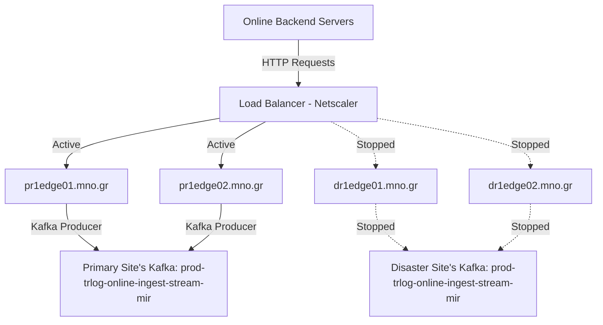
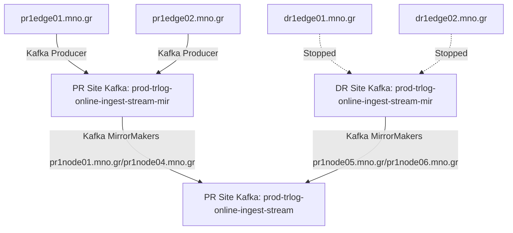
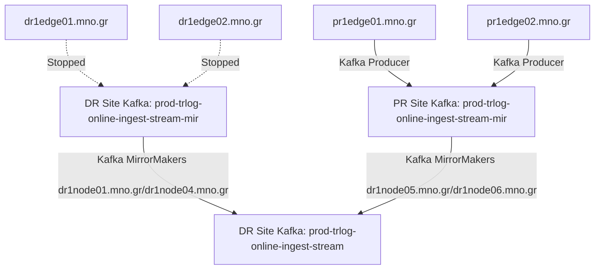
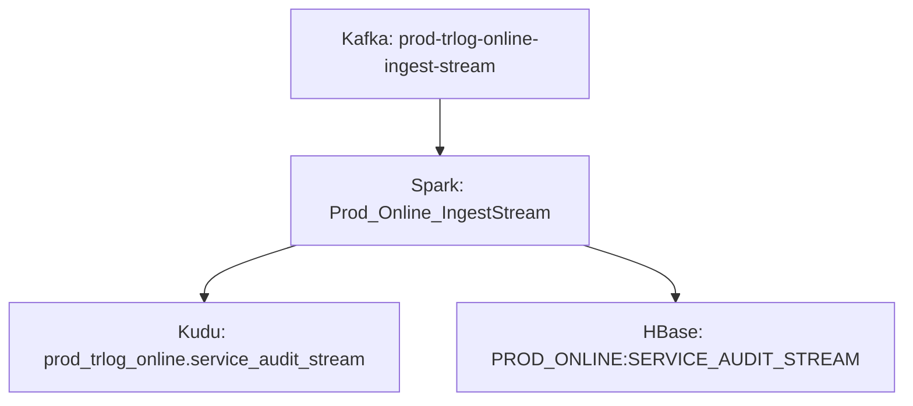

# Online

## Stream

### Wilfly

User generated events are sent to Wildfly instances installed at edge servers as HTTP POST requests. The requests originate from the backend servers of Internet Banking. Requests are loadbalanced by NetScaler (Loadbalancer) that is managed by mno's networking department. The events are then sent to a Kafka topic. Usually only one site is active (Primary Site).



**User**: `PRODREST`

**Installation Path**: `/opt/wildfly/default/prodreston`

**Deployments Path**: `/opt/wildfly/default/prodreston/standalone/deployments`

**General Configuration Path**: `/opt/wildfly/default/prodreston/standalone/configuration/standalone.xml`

**Application Configuration Path**: `/opt/wildfly/default/prodreston/standalone/configuration/BigStreamer/beanconfig/translogApiOnlineJmxConfig.xml`

**Application Logs**: `/var/log/wildfly/prodreston/server.log`

**Access Log**: `/var/log/wildfly/prodreston/access.log`

**Instructions for start/stop**: [Here](../procedures/manage_wildfly.md)

**Instructions for migrating traffic to DR site**: [Here](../procedures/failover.md)

**Alerts**:

- [PR][ONLINE] REST Endpoints Average Response Time
- [DR][ONLINE] REST Endpoints Average Response Time
- [PR][ONLINE] Ingestion Average Error rate
- [DR][ONLINE] Ingestion Average Error rate

**Troubleshooting Steps**:

- Check application logs for error messages.
- In case there are many errors in the application logs, try to restart the problematic Wildfly instance with the provided instructions.
- If the logs do not indicate a specific problem, check for any problems regarding Kafka performance.

### Kafka Mirrorring

After being published to Kafka, the traffic is mirrored to the opposite site via Kafka MirrorMaker. In order to be able to have both Sites active at any given time and simplify the failover procedure the each Site produce messages to a topic with the suffix `-mir`. The topics with the `-mir` suffix contain events published to the Site. The `-mir` topics are then copied via Kafka MirrorMakers to the final topics (no `-mir` suffix), that has all the messages from both Sites.

#### PR replication



#### DR replication



**MirrorMaker User**: `kafka`

**Configuration**: Cloudera Manager

**Logs**: Cloudera Manager

**Instructions for start/stop**: [Here](../procedures/manage_mirrormaker.md)

**Alerts**:

- Cloudera Manager alerts regarding Kafka

### Spark Streaming

After being sent to the final Kafka topic, the records are consumed by two separate Spark Streaming topologies

#### Prod_Online_IngestStream

This topology takes all records from the final Kafka topics, extracts some values and writes them to a Kudu table. It also inserts some columns that are too big for Kudu to an HBase table. This topology runs independently **on both clusters**.



**User**: `PRODREST`

**Logs**: Use Firefox on `dr1edge01.mno.gr`/`pr1edge01.mno.gr` to access the logs via YARN Resource Manager UI

**Submit Script**: `/opt/ingestion/PRODREST/online/spark/submit/submitmnoSparkTopology_stream_cluster_mno_STABLE.sh` on `dr1edge01.mno.gr`/`pr1edge01.mno.gr` (each edge server submits to a different cluster)

**Alerts**:

- [PR][ONLINE] Spark Waiting Batches
- [DR][ONLINE] Spark Waiting Batches

**Troubleshooting Steps**:

- If the alert chart has **no line**, ensure that the application is not running (Cloudera Manager > YARN > Applications) and then submit the topology using the **Submit Script**. After resubmitting the application check the old application logs for the root cause that it failed
- If the alert has exceeded the threshold, investigate HBase/Kudu for delays and check the application logs for any errors. You can also try to kill (use Cloudera Manager or yarn command) and then re-submit the topology.

## Batch

### Main script

As mentioned before, the information processed by the [Prod_Online_IngestStream](#prod_online_ingeststream) topology is stored in Kudu/HBase tables. At the end of each day (at **4:15 am in PR & DR site** by **Cron**) the records from HBase/Kudu is enriched with additional information and the transfered to a parquet table. After the data are inserted to the parquet table, sequent jobs are triggered to produce aggregations and data for external systems. This procedure runs **independantly on both sites**.

**User**: `PRODREST`

**Logs**: `/var/log/ingestion/PRODREST/online/log/online_daily_batch_jobs.log`

**Script**: `/opt/ingestion/PRODREST/common/scripts/online_daily_batch_jobs_STABLE.sh` on `dr1edge01.mno.gr`/`pr1edge01.mno.gr` (each edge server submits to a different cluster)

**Alerts**:

- _See below_

**Troubleshooting Steps**:

This procedure runs multiple steps which we will describe below with seperate troubleshooting steps for each step. Use the following steps for all alarms as a general guide:

- Identify the failed step using the alarm name
- Identify the root cause for the failed job based on the logs of the submit script/cluster application/query
- If the problem is with an external system, ask the customer to inform the owners of the external system
- if the problem is temporary or if you cannot determine the root cause of the problem, try to re-run the failed application

### Sub-steps

The following steps run **on both clusters independently**, unless specified otherwise.

#### Merge Batch

This step transfers transactions ingested by the [Stream](#stream) flow to an intermediate table and deletes the data from the original tables.

``` mermaid
  graph TD
  A[Kudu: prod_trlog_online.service_audit_stream] --> B[Spark: PROD_Online_MergeBatch]
  C[HBase: PROD_ONLINE:SERVICE_AUDIT_STREAM] --> B
  B --> D[Impala: prod_trlog_online.service_audit]
  ```

**User**: `PRODREST`

**Script Logs**: `/var/log/ingestion/PRODREST/online/log/cronExecutor_OnlineBatch_full.log`

**Spark Logs**: Use Firefox on `dr1edge01.mno.gr`/`pr1edge01.mno.gr` to access the logs via YARN Resource Manager UI

**Script**: `/opt/ingestion/PRODREST/common/scripts/cronExecutor_MergeBatchWithLock_hdfs_STABLE.sh` on `dr1edge01.mno.gr`/`pr1edge01.mno.gr` (each edge server submits to a different cluster)

**Alerts**:

- Online_Ingestion MergeBatch JOB

**Troubleshooting Steps**:

- Use the script/spark logs to identify the cause of the failure
- Ensure that no records are present in prod_trlog_online.service_audit

  ``` bash
  # eg. 09-11-2019
  impala-shell -k --ssl -i ${HOSTNAME/01/} -q "select  count(*) from prod_trlog_online.service_audit where par_dt='20191109';"
  ```

- If no records exist and no other process is up, you can ran the script again.
  - For the previous day:

    ``` bash
    /opt/ingestion/PRODREST/common/scripts/cronExecutor_MergeBatchWithLock_hdfs_STABLE.sh /user/PRODREST/lock/PROD_Online_MergeBatch LOCK_ONLINE_PROD_BATCH_MERGE_TRANS /opt/ingestion/PRODREST/online/spark/submit/submitmnoSparkTopology_batch_cluster_mno_STABLE.sh PROD_Online_MergeBatch  /opt/ingestion/PRODREST/online/lock/ FULL 1800 "`date --date='-1 day' '+%Y-%m-%d 00:00:00'`" "`date '+%Y-%m-%d 00:00:00'`"  >> /var/log/ingestion/PRODREST/online/log/cronExecutor_onlineBatch_full.log 2>&1 &
    ```

  - For a specified date:

    ``` bash
    # eg. 09-11-2019
    /opt/ingestion/PRODREST/common/scripts/cronExecutor_MergeBatchWithLock_hdfs_STABLE.sh /user/PRODREST/lock/PROD_Online_MergeBatch LOCK_ONLINE_PROD_BATCH_MERGE_TRANS /opt/ingestion/PRODREST/online/spark/submit/submitmnoSparkTopology_batch_cluster_mno_STABLE.sh PROD_Online_MergeBatch  /opt/ingestion/PRODREST/online/lock/ FULL 1800 "2019-11-09 00:00:00" "2019-11-10 00:00:00"   >> /var/log/ingestion/PRODREST/online/log/cronExecutor_onlineBatch_full.log 2>&1 &
    ```

- The process runs for well 30 minutes under normal circumstances or even longer for heavy load. Use of `screen` command advised
- If the problem is with resources (out-of-memory errors):
  - You can adjust the values at `/opt/ingestion/PRODREST/online/spark/submit/submitmnoSparkTopology_batch_cluster_mno_STABLE.sh`. At the moment these values are as high as they can go.
  - You can run the MergeBatch for parts of the day

    ``` bash
    # eg. 09-11-2019
    /opt/ingestion/PRODREST/online/spark/submit/submitmnoSparkTopology_batch_cluster_mno_STABLE.sh "2019-11-09 00:00:00" "2019-11-09 12:00:00"
    /opt/ingestion/PRODREST/online/spark/submit/submitmnoSparkTopology_batch_cluster_mno_STABLE.sh "2019-11-09 12:00:00" "2019-11-09 18:00:00"
    /opt/ingestion/PRODREST/online/spark/submit/submitmnoSparkTopology_batch_cluster_mno_STABLE.sh "2019-11-09 18:00:00" "2019-11-10 00:00:00"
    ```

- Run the rest of the steps

#### Report stats to Graphite

Reports statistics about the ingestion process.

**User**: `PRODREST`

**Script Logs**: `/var/log/ingestion/PRODREST/online/log/cron_report_stats.log`

**Script**: `/opt/ingestion/PRODREST/common/scripts/report_stats_impala_STABLE.sh` on `dr1edge01.mno.gr`/`pr1edge01.mno.gr` (each edge server submits to a different cluster)

**Alerts**:

- **Not Monitored**

**Troubleshooting Steps**:

- This process is not monitored
- You can safely skip this step
- Sample execution:

  ``` bash
  nohup  /opt/ingestion/PRODREST/common/scripts/report_stats_impala_STABLE.sh prod_trlog_online.service_audit online >> /var/log/ingestion/PRODREST/online/log/cron_report_stats.log
  ```

- Run the rest of the steps

#### Drop hourly partitions

Ndef: **ONLY DR SITE**

Drop partitions from the [Hourly Merge Batch](#hourly-merge-batch) tables

**User**: `PRODREST`

**Script Logs**: `/var/log/ingestion/PRODREST/online/log/drop_hourly_partitions.log`

**Script**: `/opt/ingestion/PRODREST/common/scripts/drop_hourly_partitions_STABLE.sh`

**Alerts**:

- Online_Migration Drop hourly partitions JOB

**Troubleshooting Steps**:

- Ensure that you are running steps for the DR site
- If you are running the steps for the Primary skip this step
- Use the script logs to identify the cause of the failure
- For the previous day:

  ``` bash
  nohup /opt/ingestion/PRODREST/common/scripts/drop_hourly_partitions_STABLE.sh "prod_trlog_online.service_audit_hourly" "`date -d '-1 day' '+%Y%m%d'`" >> /var/log/ingestion/PRODREST/online/log/drop_hourly_partitions.log 2>&1 &
  ```

- For a specified date:

  ``` bash
  # e.g. 09-11-2019
  nohup /opt/ingestion/PRODREST/common/scripts/drop_hourly_partitions_STABLE.sh "prod_trlog_online.service_audit_hourly" "20191109" >> /var/log/ingestion/PRODREST/online/log/drop_hourly_partitions.log 2>&1 &
  ```

- Run the rest of the steps

#### Execute aggregations

This flow computes aggregations for use with the [Queries](#queries).

**User**: `PRODREST`

**Script Logs**: `/var/log/ingestion/PRODREST/online/log/update_online_aggr_tables.log`

**Script**: `/opt/ingestion/PRODREST/common/scripts/update_online_aggr_tables_STABLE.sh`

**Alerts**:

- Online_Migration Aggregations JOB
- Online_Migration Aggregation_SA Impala_Insert
- Online_Migration Aggregation_SA_Index Kudu_Insert

**Troubleshooting Steps**:

- For the previous day:

  ``` bash
  /opt/ingestion/PRODREST/common/scripts/update_online_aggr_tables_STABLE.sh prod_trlog_online.service_audit prod_trlog_online.aggr_service_audit prod_trlog_online.aggr_service_audit_idx  >> /var/log/ingestion/PRODREST/online/log/update_online_aggr_tables.log 2>&1 &
  ```

- For a specified date:

  ``` bash
  # e.g. 09-11-2019
  /opt/ingestion/PRODREST/common/scripts/update_online_aggr_tables_STABLE.sh prod_trlog_online.service_audit prod_trlog_online.aggr_service_audit prod_trlog_online.aggr_service_audit_idx 20191109 >> /var/log/ingestion/PRODREST/online/log/update_online_aggr_tables.log 2>&1
  ```

- Run the rest of the steps

#### Send reports to bussiness users

Sends email reports to users for duplicate transaction IDS and leftover transactions in `prod_trlog_online.service_audit_stream`.

**User**: `PRODREST`

**Script Logs**: `-`

**Script**: `-`

**Alerts**:

- Online_Ingestion GUID_Report Impala
- Online_Ingestion GUID_Report JOB

**Troubleshooting Steps**:

- Check `/var/log/ingestion/PRODREST/online/log/online_report_duplicate_identical.log` for errors
- You can safely skip this step if not running for the previous day
- Sample execution:

  ``` bash
  /opt/ingestion/PRODREST/common/scripts/online_report_duplicate_identical_STABLE.sh  `date -d '-1 day' '+%Y%m%d'`  prod_trlog_online service_audit service_audit_duplicates >> /var/log/ingestion/PRODREST/online/log/online_report_duplicate_identical.log 2>&1 &
  /opt/ingestion/PRODREST/common/scripts/report_duplicates_kudu_hbase_impala_STABLE.sh `date --date='-1 day' '+%Y%m%d'` prod_trlog_online.service_audit_stream prod_trlog_online.service_audit_old online >> /var/log/ingestion/PRODREST/online/log/report_duplicates_kudu_hbase_impala.log 2>&1 &
  ```

#### Duplicates between Impala and Kudu/HBase

Delete data which exist both Impala and Kudu. Sometimes MergeBatch fails because YARN kills executors for exceeding memory limits. AS a result, transactions are inserted to impala and job fails before drop them from kudu and HBase

**User**: `PRODREST`

**Script Logs**: `/var/log/ingestion/PRODREST/online/log/report_duplicates_kudu_hbase_impala.log`

**Script**: `/opt/ingestion/PRODREST/common/scripts/report_duplicates_kudu_hbase_impala_STABLE.sh`

**Alerts**:

- **Not Monitored**

**Troubleshooting Steps**:

- Check `/var/log/ingestion/PRODREST/online/log/report_duplicates_kudu_hbase_impala.log` for errors
- You can safely skip this step if not running for the previous day
- Sample execution:

  ``` bash
  /opt/ingestion/PRODREST/common/scripts/report_duplicates_kudu_hbase_impala_STABLE.sh `date --date='-1 day' '+%Y%m%d'` prod_trlog_online.service_audit_stream prod_trlog_online.service_audit_old online >> /var/log/ingestion/PRODREST/online/log/report_duplicates_kudu_hbase_impala.log 2>&1
  ```

### Hourly Merge Batch

Every hour a  transfers transactions ingested by the [Stream](#stream) flow to an intermediate table and without deleting the data from the original tables. This table is used by mno to query the latest transactions.

``` mermaid
  graph TD
  A[Kudu: prod_trlog_online.service_audit_stream] --> B[Spark: PROD_Online_MergeBatch_Hourly]
  C[HBase: PROD_ONLINE:SERVICE_AUDIT_STREAM] --> B
  B --> D[Impala: prod_trlog_online.service_audit_hourly]
  ```

**User**: `PRODREST`

**Spark Logs**: Use Firefox on `dr1edge01.mno.gr`/`pr1edge01.mno.gr` to access the logs via YARN Resource Manager UI

**Alerts**:

- **Not Monitored**

**Troubleshooting Steps**:

- Use the spark logs to identify the cause of the failure
- The data in the Hourly tables is only for the current day. No need to fill missing hours, as the next MergeBatch will insert the data to the final table.

## Queries

The ingested data are queried in order to be displayed by the Online application (used by branches). The queries are submitted to the cluster as HTTP requests using the same Wildfly instances as the [Stream](#stream) flow.

```mermaid
  graph TD
  A[Online Backend Servers] -->|HTTP Requests| B[Load Balancer - Netscaler]
  B -->|Active| C[pr1edge01.mno.gr]
  B -->|Active| D[pr1edge02.mno.gr]
  B -.->|Stopped| E[dr1edge01.mno.gr]
  B -.->|Stopped| F[dr1edge02.mno.gr]
  C -->|Impala JDBC | G[Primary Site]
  D -->|Impala JDBC | G
  E -.->|Stopped| H[Disaster Site]
  F -.->|Stopped| H
```

**User**: `PRODREST`

**Installation Path**: `/opt/wildfly/default/prodreston`

**Deployments Path**: `/opt/wildfly/default/prodreston/standalone/deployments`

**General Configuration Path**: `/opt/wildfly/default/prodreston/standalone/configuration/standalone.xml`

**Application Configuration Path**: `/opt/wildfly/default/prodreston/standalone/configuration/BigStreamer/beanconfig/translogApiOnlineJmxConfig.xml`

**Application Logs**: `/var/log/wildfly/prodreston/server.log`

**Access Log**: `/var/log/wildfly/prodreston/access.log`

**Instructions for start/stop**: [Here](../procedures/manage_wildfly.md)

**Instructions for migrating traffic to DR site**: [Here](../procedures/failover.md)

**Alerts**:

- [PR][ONLINE] Query Average Response Time
- [DR][ONLINE] Query Average Response Time
- [PR][ONLINE] Query Average Error rate
- [DR][ONLINE] Query Average Error rate
- [PR][ONLINE] REST Endpoints Average Response Time
- [DR][ONLINE] REST Endpoints Average Response Time

**Troubleshooting Steps**:

- Check in Grafana dashboard `MONITORING/Monitoring Alerts` the charts that are in alerting state
- Check if the response time is constant, a single query can increase the mean value of the response time. Check the access log for entries with large response time for the specific endpoint. If it is an isolated query the customer is not impacted.
- Check application logs for error messages.
- In case there are many errors in the application logs, try to restart the problematic Wildfly instance with the provided instructions.
- If the logs do not indicate a specific problem, check for any problems regarding Impala/Kudu

### Implementation

Queries regarding Online query Impala tables stored in both HDFS and Kudu.

**Endpoints**:

- dynamic search
- by-id
- by-core-fields
- by-application
- top-by-branchcode-clientusername
- first-by-branchcode-computername
- aggr-computernum-usernum-transnum-groupby-branchcode
- aggr-transnum-groupby-branchcode-clientusername-by-branchcode
- aggr-opcodenum-transnum-groupby-opclass
- aggr-transnum-groupby-opclass-opcode-by-opclass

## Retention Mechanism

### Impala Retention

#### DEV
Every day (at **16:05 on DR site only** by **Cron**). This script drops partitions from impala table `dev_trlog_online.service_audit` older than 60 days.

**User**: `DEVREST`

**Script Logs**: `/var/log/ingestion/DEVREST/common/log/retention_mechanism_daily.log`

**Script**: `/opt/ingestion/DEVREST/common/scripts/retention_mechanism_daily_STABLE.sh`

**Alerts**:

- **Not Monitored**

**Troubleshooting Steps**:

- Use the script logs to identify the cause of the failure
- After the root cause for the failure is resolved, run manually the following command

  ``` bash  
  /opt/ingestion/DEVREST/common/scripts/retention_mechanism_daily_STABLE.sh >> /var/log/ingestion/DEVREST/common/log/retention_mechanism_daily.log 2>&1
  ```

### Additional Tables

Kudu table's `prod_trlog_online.service_audit_stream` partitions are maintained by an Oozie jobs every day. See section [Create next week kudu partitions](#create-next-week-kudu-partitions).

Parquet table's `prod_trlog_online.service_audit_hourly` partitions are dropped after each successful Merge run. See section [Drop hourly partitions](#drop-hourly-partitions).


### HBase retention

Every day (at **16:15 in both sites** by **Cron**) This script deletes rows from hbase `PROD_ONLINE:SERVICE_AUDIT_STREAM` which refere to transactions inserted 7 days ago. Those rows may have been not deleted properly after merge batch job. To do so the topology queries rows from impala table `prod_trlog_online.service_audit` inside partition with par_dt refering 7 days ago.

**User**: `PRODREST`

**Script Logs**: `/var/log/ingestion/PRODREST/online/log/daily_tools_cleanupHBaseSAS.log`

**Script**: `/opt/ingestion/PRODREST/common/scripts/daily_tools_cleanupHBaseSAS.sh` on `dr1edge01.mno.gr`/`pr1edge01.mno.gr`

**Alerts**:

- Retention OnlineCleanupHbaseSAS JOB

**Troubleshooting Steps**:

- Use the script logs to identify the cause of the failure
- After the root cause for the failure is resolved, check on `/opt/ingestion/PRODREST/no_bkp/duplicate_cid_hbase` if a manual re-run must be done for a specific date
  - For a specified date eg 2022-06-30:

    ``` bash
    /opt/ingestion/PRODREST/common/spark/submit/submitmnoSparkTopology_tools_cleanupHbaseSAS prod_trlog_online.service_audit PROD_ONLINE:SERVICE_AUDIT_STREAM LIST 20220630
    ```

##  Oozie Jobs

###  Lookup tables
Every day (at 07:00 by Oozie on DR & PR site ), we transfers 3 tables with reference data from the legacy MSSQL server, which is managed by mno, to the cluster. We keep only latest version to BigData (no partition).

**User**: `PRODREST`

**Coordinator**: `Coord_OnlineLookupTables_PROD`

**Workflow**: `ImportLookupTables`

**Local path**: `/opt/ingestion/PRODREST/hdfs_mirror/lookupTables/import_lookup_tables.sh`

**Logs**: from HUE

**Alerts**:

- **Not Monitored**

**Troubleshooting Steps**:

- Open Hue to find coordinator status and logs

###  Create next week kudu partitions
Every day (at 10:10 by Oozie on DR site and 10:30 by Oozie on PR site ), we delete old Kudu partitions and add new Kudu partitions on `prod_trlog_online.service_audit_stream`.

**User**: `PRODREST`

**Coordinator**: `Coord_OnlineCreateKuduPartitionsPROD`

**Workflow**: `CreateKuduPartitionsPROD`

**Local path**: `/opt/ingestion/PRODREST/hdfs_mirror/create_kudu_partition/create_next_weeks_partitions.sh`

**Logs**: from HUE

**Alerts**:

- **Not Monitored**

**Troubleshooting Steps**:

- Open Hue to find coordinator status and logs

There is a case that merge batch has not properly run for a specific date, **even though** the transactions for that specific date are present on impala `service_audit`. For example by moving a service_audit partiton from DR to PR or vice versa, or when merge batch failed **after** deleting transactions from kudu.

In that case we can manually mark merge batch as complete for that date, and therefore next oozie job created by `Coord_OnlineCreateKuduPartitionsPROD` will delete that partition from kudu, by manipulating HBase table `PROD_ONLINE:MERGE_BATCH_STATE_INFO`.

Example for a specific date (10/10/2022):
 - Run HBase shell
 ```
   hbase shell
   ```
 - And then inside HBase shell:
 ```
   put 'PROD_ONLINE:MERGE_BATCH_STATE_INFO', 'MergeBatchInfoKey_20221010', 'MergaBatchState:drop_hbase', 'true'
   put 'PROD_ONLINE:MERGE_BATCH_STATE_INFO', 'MergeBatchInfoKey_20221010', 'MergaBatchState:drop_hbase_time','0'
   put 'PROD_ONLINE:MERGE_BATCH_STATE_INFO', 'MergeBatchInfoKey_20221010', 'MergaBatchState:drop_kudu', 'true'
   put 'PROD_ONLINE:MERGE_BATCH_STATE_INFO', 'MergeBatchInfoKey_20221010', 'MergaBatchState:drop_kudu_time', '0'
   put 'PROD_ONLINE:MERGE_BATCH_STATE_INFO', 'MergeBatchInfoKey_20221010', 'MergaBatchState:running', 'false'
   put 'PROD_ONLINE:MERGE_BATCH_STATE_INFO', 'MergeBatchInfoKey_20221010', 'MergaBatchState:running+time', '0'
   put 'PROD_ONLINE:MERGE_BATCH_STATE_INFO', 'MergeBatchInfoKey_20221010', 'MergaBatchState:write_impala', 'true'
   put 'PROD_ONLINE:MERGE_BATCH_STATE_INFO', 'MergeBatchInfoKey_20221010', 'MergaBatchState:write_impala_time', '0'
   ```

#### DEV
Every day (at **11:00 by Oozie** on **DR site only** ), we delete old Kudu partitions and add new Kudu partitions on `dev_trlog_online.service_audit_stream`.

**User**: `DEVREST`

**Coordinator**: `Coord_OnlineCreateKuduPartitionsDEV`

**Workflow**: `CreateKuduPartitionsDEV`

**Local path**: `/opt/ingestion/DEVREST/hdfs_mirror/create_kudu_partition/create_next_weeks_partitions.sh`

**Logs**: from HUE

**Alerts**:

- **Not Monitored**
